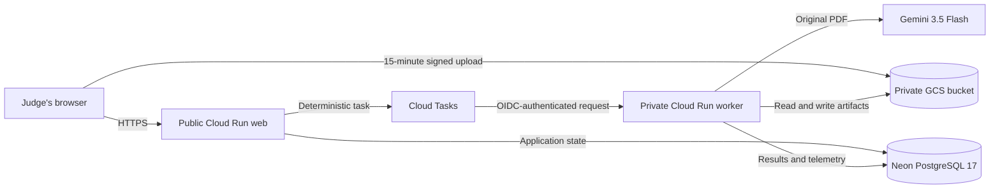

# TaxGenie

TaxGenie is an agentic BIR Form 2307 intake and review workspace built for the
**Taskmaster** category of the [All Things Agentic Hackathon](https://allthingsagentichackathon.devpost.com/).
It turns a manual, document-heavy tax workflow into a traceable queue: upload a
PDF, let Gemini extract and validate it, review any issues, and continue with
reconciled, export-ready records.

## Hackathon judging environment

- **Live app:** [taxgenie-hack-web-vxqi4pk4hq-as.a.run.app](https://taxgenie-hack-web-vxqi4pk4hq-as.a.run.app)
- **Region:** Singapore (`asia-southeast1`)
- **Database:** Neon Free PostgreSQL 17
- **AI model:** pinned `gemini-3.5-flash`
- **Primary thinking level:** `high`
- **Deployment profile:** `hackathon`
- **Data policy:** synthetic judging data only

The app requires a seeded administrator account. Judging credentials are shared
privately and must never be committed to this repository.

### Three-minute judge path

1. Sign in with the provided judging account.
2. Open **Upload** and submit one synthetic BIR 2307 PDF.
3. Watch the document move from upload to queued, processing, and its terminal
   result. Refreshing the page does not lose the persisted state.
4. Open the document to review extracted fields, validation findings, and the
   original PDF.
5. Visit **Issues**, **Validated**, **Batches**, and **Audit** to see how the
   system turns model output into an operational review workflow.

Use one certificate per PDF for the clearest demo. TaxGenie detects
multi-certificate PDFs, retains the earliest extraction for review, and marks
the file as an error rather than silently accepting an ambiguous result.

## Why it fits Taskmaster

TaxGenie is not a chat wrapper. It performs a bounded business task from intake
through durable completion:

- accepts multiple source PDFs through direct, signed uploads;
- schedules one deterministic extraction task per document;
- invokes Gemini with the original PDF and a structured-output schema;
- performs focused identity rereads when confidence is insufficient;
- validates tax fields, ATC data, identities, and duplicates;
- persists state, model telemetry, token usage, and audit attribution; and
- presents exceptions to a human reviewer instead of hiding uncertainty.

Retries are idempotent, work survives service scale-to-zero, and the worker is
not publicly callable. The agent handles extraction and verification while a
human remains responsible for consequential review decisions.

## Judging architecture



The browser uploads directly to a private, versioned GCS bucket using a
15-minute V4 signed URL. The web service validates the immutable GCS generation
and enqueues a Cloud Task. Cloud Tasks invokes the private worker with OIDC;
the worker extracts the document with Gemini and persists the structured result
in Neon. The web app then reads the durable state instead of depending on an
in-memory job.

## Near-zero cost boundary

The judging profile intentionally omits Cloud SQL, a load balancer, Cloud DNS,
Certificate Manager, VPC/NAT resources, and paid Monitoring alerts.

| Component | Hackathon configuration |
| --- | --- |
| Web | Public Cloud Run URL, 1 vCPU, 1 GiB, concurrency 20, min 0, max 1 |
| Worker | Private Cloud Run, 2 vCPU, 4 GiB, concurrency 1, min 0, max 1 |
| Queue | Cloud Tasks, concurrency 1, five attempts, 30-minute deadline |
| Storage | Private GCS, versioning, public-access prevention, 40-day lifecycle |
| Database | Neon Free, pooled application URL and direct migration URL |
| Images | Artifact Registry with cleanup policies |
| Secrets | Secret Manager and least-privilege service accounts |

The light-traffic target through judging is **$0–$1**, but budgets are alerts,
not hard caps. The GCP project should have a $5 budget alert, conservative
quotas, a free-tier Gemini Developer API key where available, and regular usage
checks.

Merge, outbound email, and permanent purge are disabled in this environment.
Their UI controls are hidden and direct API requests return
`503 { "error": "feature_disabled" }`. Extraction results, source PDF preview
and download, validation, audit views, and in-process exports remain available.

## Deploy the judging environment

The hackathon stack is an isolated Pulumi profile. It uses the public Cloud Run
`run.app` URL and does not modify the full production GCP profile or retained
AWS resources.

### Prerequisites

- a GCP project with billing enabled;
- Node.js 22+, pnpm 10+, Docker, Google Cloud CLI, and Pulumi CLI;
- authenticated Google Cloud user and Application Default Credentials;
- a Neon Free project in AWS Singapore with PostgreSQL 17;
- a pooled Neon URL for the web and worker;
- a direct Neon URL for migrations;
- a Gemini Developer API key; and
- a local Pulumi state backend or another configured Pulumi backend.

The Neon database should be named `taxgenie`, with an application role named
`taxgenie_app`. Both connection URLs must use TLS. The app uses verified TLS,
channel binding, and small connection pools suitable for Neon scale-to-zero.

### 1. Install and authenticate

```bash
pnpm install

gcloud auth login
gcloud auth application-default login

mkdir -p .pulumi-state
pulumi login "file://$(pwd)/.pulumi-state"

export GCP_PROJECT_ID='<your-hackathon-project-id>'
export GCP_REGION='asia-southeast1'
export PULUMI_STACK='hackathon'
```

### 2. Create and configure the stack

Run these commands from `backend/infra-gcp`:

```bash
cd backend/infra-gcp

pulumi stack select hackathon 2>/dev/null || pulumi stack init hackathon
pulumi config set gcp:project "$GCP_PROJECT_ID"
pulumi config set deploymentProfile hackathon
pulumi config set region "$GCP_REGION"

pulumi config set --secret geminiApiKey '<gemini-api-key>'
pulumi config set --secret betterAuthSecret '<32+-character-random-secret>'
pulumi config set --secret databaseUrl '<pooled-neon-url>'
pulumi config set --secret migrationDatabaseUrl '<direct-neon-url>'
pulumi config set --secret seedEmail '<administrator-email>'
pulumi config set --secret seedPassword '<administrator-password>'

cd ../..
```

`databaseUrl` is the pooled Neon endpoint used by the web and worker.
`migrationDatabaseUrl` is the direct endpoint used only by the migration job.
They are injected as `DATABASE_URL` into their intended runtime and are never
exported as stack outputs.

Do not put real credentials in the example Pulumi YAML, `.env` files committed
to Git, shell scripts, deployment logs, or this README.

### 3. Deploy in observable stages

```bash
pnpm deploy:hackathon:bootstrap
pnpm deploy:hackathon:images
pnpm deploy:hackathon:preview
pnpm deploy:hackathon:infra
pnpm deploy:hackathon:migrate

export TAXGENIE_SEED_EMAIL='<same administrator email>'
export TAXGENIE_SEED_PASSWORD='<same administrator password>'
pnpm deploy:hackathon:smoke
```

The preview stage rejects Cloud SQL, load-balancer, DNS, certificate, and
Monitoring alert resources. The smoke test verifies the public health endpoint,
private worker, private bucket, completed migration/seed job, and administrator
sign-in.

After the staged workflow succeeds, the complete deployment can be repeated
with:

```bash
pnpm deploy:hackathon:all
```

The scripts resolve resource names and URLs from Pulumi outputs rather than
hardcoding them. See the [full hackathon runbook](backend/infra-gcp/HACKATHON.md)
and [example stack configuration](backend/infra-gcp/Pulumi.hackathon.yaml.example).

## Live acceptance checklist

- [ ] Migration and administrator seed job succeeds against Neon.
- [ ] Public web health endpoint responds successfully.
- [ ] Seeded administrator can sign in.
- [ ] Synthetic PDF uploads through a signed GCS URL.
- [ ] Cloud Tasks invokes the private worker.
- [ ] Extraction reaches a successful terminal state.
- [ ] Original PDF and extracted result both open in the app.
- [ ] Telemetry records requested and returned model, `high` thinking, token
      usage, GCS generation, and Cloud Task dispatch ID.
- [ ] Unauthenticated worker access is rejected.
- [ ] The GCS bucket has no public IAM members.
- [ ] Cloud Run, Cloud Tasks, GCS, Neon, and Gemini evidence is captured for the
      submission demo.

## Local development

Copy the root environment template and supply local-only values:

```bash
cp .env.sample .env.local
```

At minimum, local development needs PostgreSQL, a GCS bucket, a Cloud Tasks
queue, service-account signing credentials, Better Auth configuration, and a
Gemini API key. Use `TAXGENIE_ENV_FILE` to select the file explicitly:

```bash
TAXGENIE_ENV_FILE=.env.local pnpm dev:web
TAXGENIE_ENV_FILE=.env.local pnpm dev:worker
```

The web and worker are separate processes. They may both use port `8080` in
different Cloud Run containers, but locally they must bind different host ports.
See [.env.sample](.env.sample) for the provider-neutral runtime contract.

## Verification

```bash
pnpm typecheck
pnpm test
pnpm --dir webapp/tax-genie build
```

Cloud Build creates production web, worker, and migrator containers and pushes
immutable Artifact Registry digests during `deploy:hackathon:images`.

## Repository map

- `webapp/tax-genie/`: TanStack Start web app, server routes, migrations, and UI.
- `backend/worker/`: private Cloud Tasks HTTP worker and Gemini extraction flow.
- `backend/shared/`: shared contracts, environment parsing, logging, and tracing.
- `backend/infra-gcp/`: production and hackathon Pulumi profiles.
- `backend/merge-worker/`: retained AWS-only merge worker code, excluded from
  GCP deployments.
- `scripts/`: staged GCP build, deploy, migration, preview, and smoke workflows.
- `app/` and `modules/`: retained Python extraction service and supporting code.

The legacy SST/AWS infrastructure source was removed from the active tree and
preserved at Git tag `archive/aws-infra-before-removal-2026-08-31`. Its removal
does not destroy or alter any deployed AWS resource.

## Teardown after judging

Keep the environment only for the judging window. Confirm the selected stack is
exactly `hackathon` before destroying it:

```bash
pulumi --cwd backend/infra-gcp stack select hackathon
pulumi --cwd backend/infra-gcp destroy --stack hackathon
```

Then delete the Neon hackathon project. This removes only synthetic judging
resources; it does not migrate, synchronize, or delete production or retained
AWS data.
