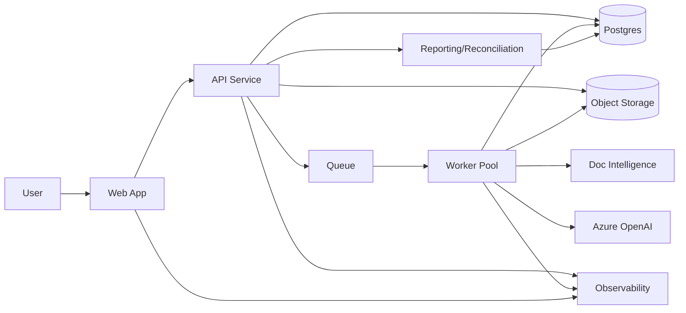
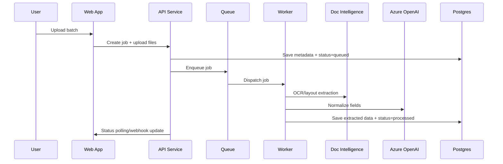

# Architecture Overview — Project TaxTrack (BIR 2307 Automation)

This document describes the target production architecture that expands the current API-focused POC. It adds a web application, async agent workflow, queue-worker processing, and full observability/analytics.

## Goals

- Provide a web UI for upload, status tracking, review, and reporting.
- Run extraction and reconciliation asynchronously with queue-worker architecture.
- Ensure traceability with audit logging, metrics, and distributed tracing.
- Enable product analytics for usage and operational insights.
- Maintain security, reliability, and cost controls.

## High-Level Architecture



## Core Services

### 1) Web Application (UI)
- Upload PDFs, manage batches, and view extraction results.
- Show job status, errors, and confidence scores.
- Provide report download and reconciliation views.
- Role-based access control (admin/reviewer/ops).

### 2) API Service (FastAPI)
- Handles auth, file upload, job submission, and results retrieval.
- Validates input and writes metadata to Postgres.
- Emits events for analytics and observability.
- Exposes REST endpoints for UI and integrations.

### 3) Queue + Worker Pool
- Async processing pipeline for extraction, validation, and reconciliation.
- Preferred stack: Redis + RQ/Celery, or a managed queue (SQS/Cloud Tasks).
- Supports retries, backoff, and a dead-letter queue.
- Ensures idempotency via file hash + job key.

### 4) Document Processing Agent Workflow
- Agents encapsulate each stage:
  - Ingest/validate file format and integrity.
  - OCR/layout extraction (Document Intelligence).
  - LLM normalization (Azure OpenAI).
  - Validation rules and ATC variance checks.
  - Duplicate detection and file renaming.
  - Reconciliation with revenue datasets.
- Each stage emits structured logs and status updates.

### 5) Storage
- **Object Storage**: raw PDFs, converted images, and extracted JSON.
- **Postgres**: job metadata, extracted fields, reconciliation status, audit logs.
- **Cache**: results of DI/LLM + final outputs (existing cache strategy).

## Async Processing Flow



## Observability

- **Tracing**: OpenTelemetry across Web/API/Workers with a shared correlation ID.
- **Langfuse**: LLM traces, prompts, costs, and per-field confidence monitoring.
- **Metrics**: queue latency, job throughput, error rate, API p95, cost per doc.
- **Logging**: structured JSON logs with job_id, file_hash, user_id, stage.

## Analytics

- Track user actions: uploads, downloads, approvals, error overrides.
- Track pipeline outcomes: per-batch success rate, error categories.
- Build dashboards for operational KPIs and cost controls.

## Data Model (Core Entities)

- **User**: identity, role, organization.
- **Batch**: group of uploaded files with a processing status.
- **Document**: file metadata, hash, storage pointer.
- **Job**: processing state machine and timestamps.
- **Extraction**: normalized fields + confidence.
- **Validation**: rule results and error tags.
- **Reconciliation**: match results and variance.
- **AuditLog**: immutable log of user actions and system events.

## Reliability & Scaling

- Horizontal scaling for API and Worker pools.
- Rate limiting and circuit breaking for external AI services.
- Retry strategy with exponential backoff and DLQ.
- Idempotent jobs to handle replays safely.

## Security & Compliance

- Encrypt data at rest and in transit.
- Store secrets in a dedicated secret manager.
- PII redaction in logs; audit logs are immutable.
- Role-based access control and least-privilege service accounts.
- Configurable data retention policies for PDFs and extracted data.

## Deployment Topology

- **Web App**: static hosting with CDN.
- **API Service**: containerized FastAPI.
- **Worker Pool**: containerized workers with autoscaling.
- **Queue**: managed Redis/SQS.
- **DB**: managed Postgres.
- **Storage**: S3-compatible object storage.
- **Observability**: Langfuse + centralized logging/metrics stack.

## Azure Tenancy (Initial Deployment)

This section adapts the topology for an Azure-first deployment and a VM-based approach.

### Assumptions (Initial Sizing)
- ~30 users.
- ~3,000 PDFs/month.
- ~500 KB per PDF (raw input).
- Workload is bursty (batch uploads).

### Storage Estimates
- Raw PDFs: ~1.5 GB/month.
- Processed artifacts (images + JSON) vary widely; assume 3x to 10x raw size depending on page count and rasterization.
- Set retention policies to avoid unbounded growth (e.g., raw PDFs 6–12 months; derived images 30–90 days).

### Minimal VM-Based Layout (Start Small)
- **VM 1 (API + Web)**: 2 vCPU / 4–8 GB RAM.
- **VM 2 (Workers)**: 4 vCPU / 8–16 GB RAM.
- **Queue**: Azure Storage Queue or Service Bus (managed).
- **DB**: Azure Database for PostgreSQL (managed).
- **Object Storage**: Azure Blob Storage.
- **Observability**: Azure Monitor + Log Analytics; Langfuse self-hosted on a small VM or container.

This keeps infra costs low while allowing independent scaling of workers when batch volume increases.

### Scale Path (When Needed)
- Add more worker VMs or move workers to VM Scale Sets.
- Separate "heavy" workers (image conversion + OCR) from "light" workers (validation/reporting).
- Add a cache layer (Azure Cache for Redis) if queue or API latency increases.

## Cost Estimate (Southeast Asia, 30 Users / 3,000 Docs per Month)

This section provides a lightweight monthly estimate. Use it to size the initial budget and refine once you have
real traffic, page counts, and token usage.

### Assumptions
- Region: Southeast Asia for core infra.
- Volume: 3,000 PDFs/month.
- Average pages per PDF: 2 (adjust if higher).
- LLM usage: GPT-4.1 mini (baseline) or GPT-4.1 (higher accuracy).
- Token estimate per document: 2,000 input tokens + 500 output tokens.
- Prices are list rates and can change. Re-validate before procurement.

### Mistral Document AI (Azure AI Foundry)
- **Pricing (per 1K pages)**: $3.00 (Global), $3.30 (Data Zone). See pricing/region notes below.
- **Monthly estimate**:
  - 3,000 docs x 2 pages = 6,000 pages
  - Global: 6 x $3.00 = **~$18/month**
  - Data Zone: 6 x $3.30 = **~$19.80/month**

**Availability note:** Mistral Document AI is currently listed for `eastus2` and `swedencentral`. If data residency
requires Southeast Asia, plan for cross-region processing or evaluate alternative OCR options.

### Azure OpenAI (Token Costs, SEA via Retail Prices API)

The Azure OpenAI pricing page is rendered dynamically; use the Azure Retail Prices API for region-specific rates.
Below are the Southeast Asia list rates used for estimates (as of 2026-01-25) and example totals.

Retail Prices API query (example):
```
https://prices.azure.com/api/retail/prices?$filter=serviceName eq 'Foundry Models' and armRegionName eq 'southeastasia' and productName eq 'Azure OpenAI'
```

**Southeast Asia list rates (per 1K tokens):**
- GPT-4.1: Input **$0.002**, Output **$0.008**
- GPT-4.1 mini: Input **$0.0004**, Output **$0.0016**
- GPT-4.1 nano: Input **$0.0001**, Output **$0.0004**

**Per-document estimate (2K input + 0.5K output):**
- GPT-4.1 mini: (2 x 0.0004) + (0.5 x 0.0016) = **$0.0016/doc**
- GPT-4.1: (2 x 0.002) + (0.5 x 0.008) = **$0.008/doc**

**Monthly estimate (3,000 docs):**
- GPT-4.1 mini: 3,000 x $0.0016 = **~$4.80/month**
- GPT-4.1: 3,000 x $0.008 = **~$24/month**

### Storage & Data Transfer (Order of Magnitude)
- Raw PDFs: 3,000 x 0.5 MB = **~1.5 GB/month**
- Derived artifacts (images + JSON): **~3x to 10x** raw size depending on rasterization.
- Use retention to cap growth (e.g., 6–12 months raw, 30–90 days derived).

### VM Baseline (Estimate Only)

If staying VM-based initially:
- **API/Web VM**: B2as v2 (2 vCPU, 8 GB) or similar.
- **Worker VM**: B4ls v2 (4 vCPU, 8 GB) or similar.

Compute costs vary by region and SKU. Use the Azure Retail Prices API to price the exact VM sizes in Southeast Asia.

### Cost Drivers to Re-Check After Pilot
- Average pages per document.
- Token usage per document (prompt + extracted fields).
- Batch size and peak concurrency.
- Retention policy for PDFs and derived artifacts.

## What This Adds Beyond the POC

- Web UI for end users and reporting.
- Async processing and queue-based orchestration.
- Unified observability across the pipeline.
- Analytics for product and operations.
- Production-grade reliability and security controls.
