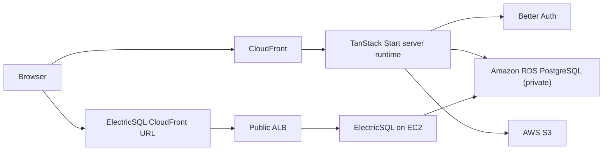
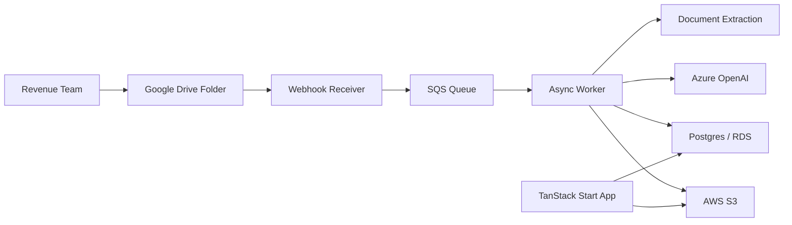

# TaxTrack Architecture

This document describes the current application architecture and the broader platform direction for TaxTrack.

It is grounded in the current implementation under:

- `webapp/tax-track`
- `backend/infra`
- `backend/lambda`
- `backend/worker`

Related references:

- [TECHSTACK.md](/Users/mharvicchicano/projects/side/bacon/bir2307/extract-bir-2307/docs/TECHSTACK.md)
- [TAXTRACK_APP_INFRA_CHANGES.md](/Users/mharvicchicano/projects/side/bacon/bir2307/extract-bir-2307/docs/TAXTRACK_APP_INFRA_CHANGES.md)
- [ADMIN_USER_ACCOUNT_SETTINGS_PAGE.md](/Users/mharvicchicano/projects/side/bacon/bir2307/extract-bir-2307/docs/ADMIN_USER_ACCOUNT_SETTINGS_PAGE.md)
- [users-module-plan.md](/Users/mharvicchicano/projects/side/bacon/bir2307/extract-bir-2307/docs/users-module-plan.md)

## Architecture Goals

- Keep the web application publicly reachable while the database remains private.
- Enforce authentication and role-based access in both the UI and server handlers.
- Support admin-managed accounts only. Public signup stays disabled.
- Keep local development viable with a local PostgreSQL database.
- Preserve a path to the broader async processing platform without forcing every environment to deploy the full stack.

## Current Deployment Model

TaxTrack currently has two practical architecture layers:

1. The implemented app runtime used for the web product.
2. The broader async platform used for webhook intake and worker-based processing.

The most important current deployment target is the `app` SST scope:

- webapp
- RDS PostgreSQL
- ElectricSQL

This excludes:

- webhook Lambda
- async worker
- Langfuse

That split keeps the app stack smaller for environments where the UI, auth, and core database access are the immediate priority.

## Current App Architecture

### What this means

- End users connect to CloudFront, not directly to the database.
- Server-side TanStack Start code runs inside the VPC and reaches the private RDS instance.
- ElectricSQL is exposed through its own public HTTPS path for browser-safe access.
- The primary app database is private PostgreSQL, not Aurora Serverless.

## Application Layer Breakdown

### 1. Web App

Location:

- [webapp/tax-track](/Users/mharvicchicano/projects/side/bacon/bir2307/extract-bir-2307/webapp/tax-track)

Key responsibilities:

- authenticated UI for operations and reporting
- SSR/server-side route handling through TanStack Start
- admin user management
- reports, audit trail, reconciliation, validated docs, issue review
- server routes for auth, audit, user management, and selected S3-backed reads

Important implementation points:

- TanStack Start is deployed through `sst.aws.TanStackStart`.
- Server runtime receives `DATABASE_URL` and optional `ELECTRICSQL_URL`.
- In AWS-backed deployments the server runtime is attached to private subnets and the Lambda security group.

Relevant files:

- [webapp.ts](/Users/mharvicchicano/projects/side/bacon/bir2307/extract-bir-2307/backend/infra/webapp.ts)
- [__root.tsx](/Users/mharvicchicano/projects/side/bacon/bir2307/extract-bir-2307/webapp/tax-track/src/routes/__root.tsx)

### 2. Authentication and Session Layer

Location:

- [auth-server.ts](/Users/mharvicchicano/projects/side/bacon/bir2307/extract-bir-2307/webapp/tax-track/src/lib/auth-server.ts)
- [auth-client.ts](/Users/mharvicchicano/projects/side/bacon/bir2307/extract-bir-2307/webapp/tax-track/src/lib/auth-client.ts)

Current model:

- Better Auth with email/password login
- database-backed sessions
- cookie caching enabled
- trusted-origin handling for CloudFront and forwarded-host deployments
- seeded admin bootstrap support through environment variables

Account model:

- public signup is disabled
- admins provision users
- users can be forced to change password on first login or after reset

### 3. Authorization and Route Access

Location:

- [access-control.ts](/Users/mharvicchicano/projects/side/bacon/bir2307/extract-bir-2307/webapp/tax-track/src/lib/access-control.ts)

Current roles:

- `admin`
- `editor`
- `viewer`

Current route policy:

- `/settings`: `admin` only
- `/upload`: `admin`, `editor`
- `/dashboard`, `/batch-status`, `/issues`, `/validated`, `/reconciliation`, `/reports`, `/audit`, and detail pages: all authenticated roles

Export permissions are separate from route access:

- `canExportPdf`
- `canExportExcel`

Those are per-user overrides, while route access remains role-based.

Enforcement points:

- route-level gating in [__root.tsx](/Users/mharvicchicano/projects/side/bacon/bir2307/extract-bir-2307/webapp/tax-track/src/routes/__root.tsx)
- sidebar visibility in [app-sidebar.tsx](/Users/mharvicchicano/projects/side/bacon/bir2307/extract-bir-2307/webapp/tax-track/src/components/app-sidebar.tsx)
- server-side checks in protected API routes

### 4. User Administration Module

Location:

- [settings.tsx](/Users/mharvicchicano/projects/side/bacon/bir2307/extract-bir-2307/webapp/tax-track/src/routes/settings.tsx)

Responsibilities:

- list users
- create users with temporary passwords
- update role, team, and export permissions
- reset passwords
- deactivate/reactivate users
- display the role access matrix

The settings page is an operational admin surface, not a personal profile page.

Reference:

- [ADMIN_USER_ACCOUNT_SETTINGS_PAGE.md](/Users/mharvicchicano/projects/side/bacon/bir2307/extract-bir-2307/docs/ADMIN_USER_ACCOUNT_SETTINGS_PAGE.md)

### 5. Database Layer

Database:

- Amazon RDS PostgreSQL
- currently provisioned as a single `t4g.micro` instance with `20 GB` storage in AWS-backed environments

Local development:

- `TAXTRACK_LOCAL_DATABASE_URL`
- Drizzle local schema workflow remains:
  - `pnpm db:generate:web`
  - `pnpm db:migrate:web`

Runtime characteristics:

- cloud connections use `sslmode=require`
- local connections remain unmodified
- the web app and migration Lambda use Node `pg`

Relevant files:

- [data.ts](/Users/mharvicchicano/projects/side/bacon/bir2307/extract-bir-2307/backend/infra/data.ts)
- [db.ts](/Users/mharvicchicano/projects/side/bacon/bir2307/extract-bir-2307/webapp/tax-track/src/lib/db.ts)
- [schema.ts](/Users/mharvicchicano/projects/side/bacon/bir2307/extract-bir-2307/webapp/tax-track/src/lib/schema.ts)

### 6. Migration Path

Deploy-time migrations are run by a dedicated Lambda:

- [db-migrate.ts](/Users/mharvicchicano/projects/side/bacon/bir2307/extract-bir-2307/backend/infra/lambda/db-migrate.ts)

Current behavior:

- reads Drizzle SQL files from `webapp/tax-track/src/lib/migrations`
- keeps the migration table in `public.__drizzle_migrations`
- runs inside the VPC
- uses the same managed Postgres `DATABASE_URL`

### 7. ElectricSQL

Location:

- [compute-electricsql.ts](/Users/mharvicchicano/projects/side/bacon/bir2307/extract-bir-2307/backend/infra/compute-electricsql.ts)

Current delivery path:

- EC2 instance running the ElectricSQL container
- public ALB
- CloudFront distribution in front of the ALB

Purpose:

- allow the web app to consume sync functionality over a browser-safe public URL
- keep the underlying database private

## Infrastructure Layer Breakdown

### Network

Location:

- [network.ts](/Users/mharvicchicano/projects/side/bacon/bir2307/extract-bir-2307/backend/infra/network.ts)

Current shape:

- 1 VPC
- 2 public subnets
- 2 private subnets
- internet gateway
- public and private route tables
- S3 gateway endpoint for private subnets

The app scope avoids NAT instance deployment. That keeps cost and operational surface lower while still supporting:

- public web delivery
- private DB access from VPC-attached compute
- S3 access from private subnets

### Infrastructure Scopes

Defined in:

- [index.ts](/Users/mharvicchicano/projects/side/bacon/bir2307/extract-bir-2307/backend/infra/index.ts)

Current scopes:

- `all`
- `backend`
- `web`
- `app`

Recommended scope for the deployed application:

- `app`

That gives:

- `webUrl`
- `databaseUrl`
- `electricSqlUrl`

without bringing up the full worker/webhook/langfuse stack.

## Broader Platform Direction

The repository still contains the wider async processing architecture for the complete BIR 2307 pipeline.

This path remains relevant for:

- webhook-driven Drive intake
- async extraction and validation
- reconciliation pipeline orchestration
- observability through Langfuse

## Request Flows

### Login Flow

1. Browser submits credentials to Better Auth endpoints under `/api/auth`
2. Better Auth reads/writes the auth tables in Postgres
3. Session is established in the database and exposed to the app through cookie-backed auth
4. Root route guard loads session and applies route policy

### First Login / Password Reset Flow

1. Admin creates or resets a user
2. User receives a temporary password
3. User signs in
4. App redirects to `/change-password`
5. Password is updated
6. `mustChangePassword` is cleared in the database
7. App refreshes the session and routes to the intended page

### Protected Page Flow

1. Browser requests a route
2. Root route loads session
3. Access policy resolves the protected route group
4. Role is checked against the policy matrix
5. Unauthorized users are redirected away from restricted routes

## Documentation Notes

The previous architecture notes referred to Aurora Serverless. That is no longer the current app database design.

The authoritative current state is:

- web runtime on TanStack Start
- Better Auth for auth/session/RBAC bootstrap
- private RDS PostgreSQL
- ElectricSQL exposed through CloudFront + ALB + EC2
- role-based route and API enforcement for the implemented webapp surfaces
