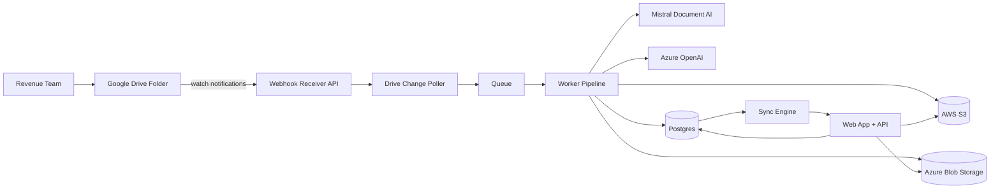

# Architecture Overview - Project TaxTrack (BIR 2307 Automation)

This document defines the target architecture aligned to `docs/original_requirement/requirement.md` and current implementation direction.

## Requirement Alignment

- Requirement says 2307 forms are manually downloaded due to source access constraints.
- Operating model update: users do not upload source PDFs into TaxTrack.
- Source-of-truth intake is a designated Google Drive folder where the Revenue team places files.
- TaxTrack listens for new and updated files through Google Drive webhook notifications, pulls the files, processes them, and stores outputs in cloud storage.

## Architecture Goals

- Automate 2307 ingestion from Google Drive without requiring user file upload in the app.
- Process documents asynchronously for extraction, validation, duplicate segregation, and reconciliation.
- Persist raw and derived artifacts in S3 and/or Azure Blob Storage.
- Provide near-real-time status and auditability in the web application.
- Enforce confidentiality, integrity, and operational reliability.

## High-Level Architecture

## Core Components

### 1) Web App + API (TanStack Start)

- Provides operational dashboard, batch status, duplicates/errors review, reconciliation, report generation, and audit trail.
- Does not accept source-file uploads for the production flow.
- Supports admin actions: connect Drive, configure watched folders, trigger backfill/reprocess, download results.

### 2) Google Drive Intake Service (Webhook + Poller)

- Registers Drive watch channels for target folders (`changes.watch` or `files.watch`).
- Receives notification callbacks at a public HTTPS webhook endpoint.
- Verifies Google headers and channel token.
- Uses `changes.list` with stored page token to enumerate affected files.
- Pulls file metadata and content for matching folders/mime types.
- Enqueues processing jobs with idempotency keys.

#### Intake Lifecycle

1. Admin connects Drive and selects the target folder.
2. System stores `channelId`, `resourceId`, `expiration`, and `pageToken`.
3. On each webhook event, system fetches changes and schedules jobs.
4. A renewal worker rotates watch channels before expiration.
5. A backfill task can process already uploaded/current files in the folder.

### 3) Queue + Worker Pipeline

- Queue (SQS) decouples ingestion from processing.
- Workers execute these stages:
1. Document fetch and basic validation.
2. OCR/layout extraction.
3. LLM normalization.
4. Validation and ATC-based tax-base checks.
5. Duplicate detection and segregation.
6. Reconciliation and report generation.
- Retry with exponential backoff + dead-letter queue.

### 4) AI Services

- OCR/Layout: Mistral Document AI.
- Structured extraction/normalization: Azure OpenAI.
- Supports field confidence tracking and structured output validation.

### 5) Data Stores

- `Postgres`: jobs, batches, document metadata, extracted fields, validation results, reconciliation records, audit logs, Drive channel state.
- `S3` and/or `Azure Blob` store:
1. Source copies pulled from Drive.
2. Derived artifacts (page images, JSON extraction, renamed PDFs).
3. Reports (monthly/quarterly reconciliation exports).
4. Error and duplicate segregated artifacts.

## Processing Rules From Requirement

- Required extraction: period covered, payee/payor info, ATC code, tax base, tax withheld, printed name, signature.
- Error routing for incomplete/invalid records.
- ATC work-back computation rates:
1. `WC160 = 2%`
2. `WC158 = 1%`
3. `WC051 = 15%`
- Variance threshold: `<= PHP 100` valid, `> PHP 100` error.
- Naming convention: `Co.Name_TIN_PeriodEnd_Sequence`.
- Reconciliation output supports monthly and quarterly reporting.

## Security and Compliance

- End-to-end TLS for Drive webhook and cloud service traffic.
- Encryption at rest for DB and object storage.
- Least-privilege IAM/service accounts for Drive API, queue, and storage.
- Immutable audit logs for ingestion events, processing decisions, and user actions.
- Configurable retention lifecycle for raw, derived, and report files.

## Reliability and Operations

- Idempotency by Drive file ID + revision + hash.
- Duplicate event suppression and replay-safe processing.
- Dead-letter queue for failed jobs and triage dashboard visibility.
- Channel expiration monitoring with proactive renewal.
- Health checks for webhook receiver, workers, queue lag, and AI dependencies.

## Deployment Topology (Recommended)

- AWS stack:
1. Web App + API
2. Queue/Worker runtime
3. Postgres
4. S3
- Azure stack:
1. Azure OpenAI + Mistral Document AI
2. Optional Blob Storage for mirrored/primary artifact storage
- Google Cloud (SaaS):
1. Google Drive API webhook + change feed as ingestion trigger
