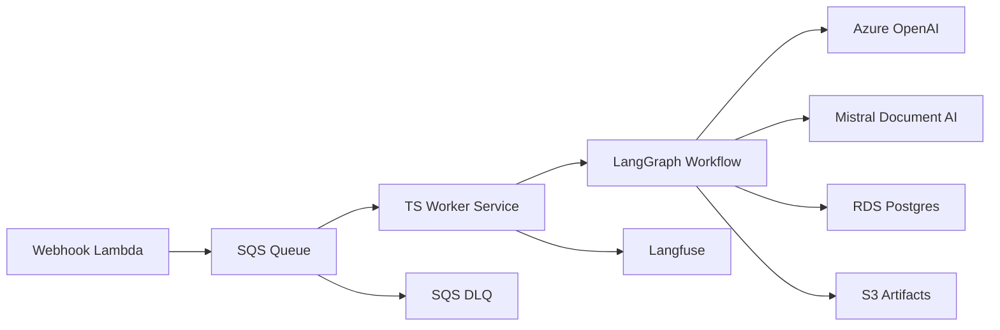

# Async Worker Planning - SQS Event Processing

This document defines the implementation plan for the async worker that consumes events from AWS SQS and runs the BIR 2307 workflow using LangGraph.

## Scope and Goals

- Consume ingestion events from SQS as the system of record for async processing.
- Orchestrate document workflow in LangGraph (download, extract, validate, persist).
- Keep a minimal HTTP surface with Express for health, readiness, and basic admin operations.
- Ensure retry safety with idempotency, DLQ handling, and observable execution traces.

## Selected Stack

| Concern | Technology |
| --- | --- |
| Runtime language | TypeScript (Node.js) |
| Worker service | Express + background SQS poller |
| Queue consumer | AWS SDK v3 (`@aws-sdk/client-sqs`) |
| Workflow orchestration | LangGraph JS |
| State/checkpoint persistence | PostgreSQL (RDS) |
| Artifact storage | AWS S3 |
| Observability | Langfuse + CloudWatch logs/metrics |
| Deployment target | ECS (Fargate or ECS on EC2) |

## High-Level Flow

## Service Design

### 1) Process model

- Single service container runs:
1. Express server for `/healthz`, `/readyz`, and admin endpoints.
2. Background poller loop that consumes SQS messages using long polling.

### 2) Express endpoints (minimal)

- `GET /healthz`: process alive check.
- `GET /readyz`: dependency readiness check (Postgres, SQS, optional Langfuse client init).
- `POST /admin/pause`: pause message consumption.
- `POST /admin/resume`: resume message consumption.
- `POST /admin/drain`: stop polling and wait for in-flight jobs to finish (for controlled deploys).

### 3) SQS consumer behavior

- Use long polling (`WaitTimeSeconds=20`) to reduce empty receives.
- Receive in small batches first (`MaxNumberOfMessages=1-5`) and tune later.
- For each message:
1. Parse and validate payload schema.
2. Compute idempotency key (for example `sourceId + revision + contentHash`).
3. Skip or short-circuit if already completed.
4. Execute LangGraph workflow.
5. On success, delete message.
6. On failure, do not delete message so SQS retries.
- Extend visibility timeout for long-running steps.

## Event Contract (v1)

Queue message body should include:

- `eventId`: unique event id.
- `source`: source type (`google-drive`).
- `sourceFileId`: source file identifier.
- `revision`: source revision/version.
- `artifactUri`: source artifact location (or pointer).
- `receivedAt`: ISO timestamp.
- `traceId`: correlation id for observability.

## LangGraph Integration Plan

- Build one graph per document job.
- Node sequence:
1. `load_input` (resolve metadata and artifacts)
2. `extract_document` (Mistral Document AI)
3. `normalize_fields` (Azure OpenAI)
4. `validate_rules` (BIR and ATC checks)
5. `persist_results` (Postgres + S3)
- Persist graph state/checkpoints in Postgres for resumability and debugging.
- Attach tracing metadata to each run (`eventId`, `traceId`, `jobId`).

## Data and Persistence

- Postgres tables (minimum set):
1. `worker_jobs` (status, retries, durations, error summary)
2. `worker_job_steps` (step-level timing and outcome)
3. `worker_idempotency` (dedupe keys and final outcome)
- S3 paths:
1. Raw source copy
2. Intermediate extraction JSON
3. Final normalized output and reports

## Failure Handling

- Retries are managed by SQS redelivery + visibility timeout.
- Message goes to DLQ after max receives.
- Classify errors:
1. Transient (network/timeouts/rate limits): retry.
2. Permanent (invalid payload/unsupported file): mark failed and allow DLQ routing.
- Expose admin path for replay from DLQ after remediation.

## Observability and Operations

- Structured logs in JSON with `eventId`, `traceId`, `jobId`, and `step`.
- Send LangGraph execution traces to Langfuse.
- Track CloudWatch metrics:
1. Queue depth
2. Oldest message age
3. Success/failure rate
4. Processing latency (p50/p95)
5. DLQ inflow count
- Define alerts for queue backlog, high failure rate, and DLQ growth.

## Deployment and Scaling

- Start with one ECS service and conservative concurrency.
- Scale horizontally by queue backlog per running task.
- Graceful shutdown behavior:
1. Stop accepting new messages.
2. Complete in-flight runs.
3. Exit cleanly before task termination.

## Security and Configuration

- IAM least privilege for SQS, S3, CloudWatch, and secrets access.
- Secrets in AWS Secrets Manager or SSM Parameter Store.
- Required env vars (initial):
1. `AWS_REGION`
2. `SQS_QUEUE_URL`
3. `SQS_DLQ_URL`
4. `DATABASE_URL`
5. `S3_BUCKET`
6. `AZURE_OPENAI_API_KEY`
7. `AZURE_OPENAI_ENDPOINT`
8. `MISTRAL_API_KEY` (or provider-specific key)
9. `LANGFUSE_PUBLIC_KEY`
10. `LANGFUSE_SECRET_KEY`
11. `LANGFUSE_HOST`

## Implementation Phases

1. Bootstrap worker service skeleton (`TypeScript + Express + SQS poll loop`).
2. Implement payload validation, idempotency, and basic job persistence.
3. Integrate LangGraph nodes with stubbed providers.
4. Integrate real Mistral and Azure OpenAI calls.
5. Add observability (Langfuse + metrics + alerts).
6. Add DLQ replay/admin tools and production hardening.

## Open Decisions

- Final deployment mode: ECS Fargate vs ECS on EC2.
- Initial concurrency and visibility timeout values.
- Exact queue payload schema ownership and versioning policy.
- DLQ replay policy (manual only vs controlled automated replay).
