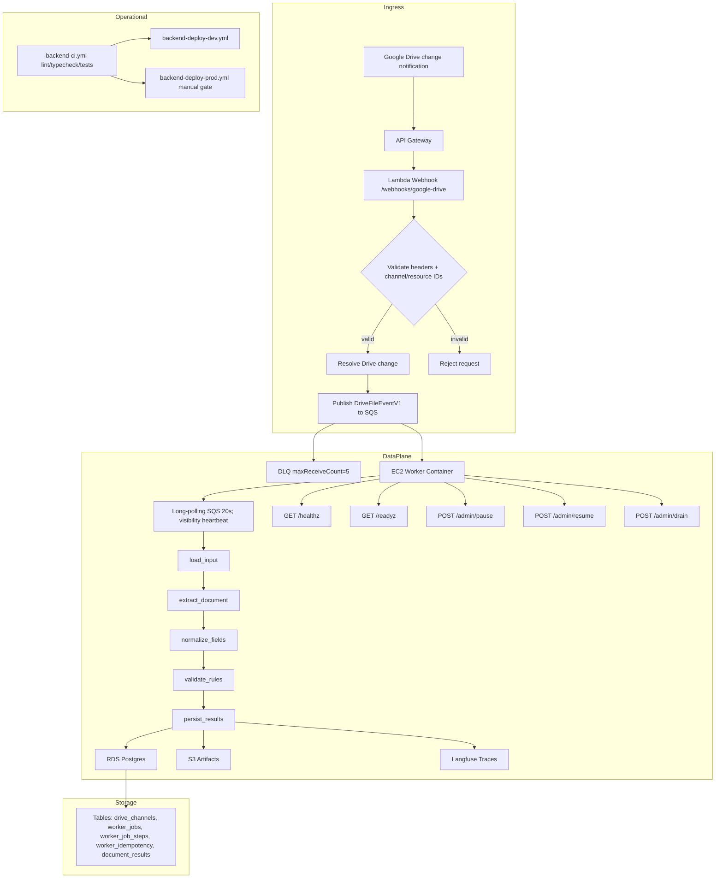
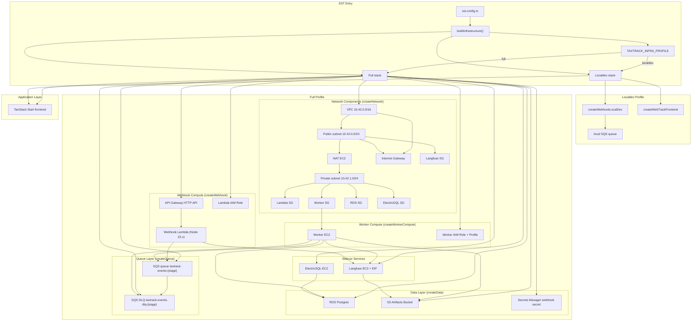

# Backend Implementation Plan (TypeScript + AWS)

This document is the implementation reference for the new backend stack under `backend/`.

## Scope

- Replace the Python ingestion/processing path with TypeScript services.
- Use AWS Lambda + API Gateway for webhook ingress.
- Use SQS Standard + DLQ for asynchronous queueing.
- Use an EC2-hosted worker (Docker) for LangGraph execution.
- Use RDS Postgres for state and S3 for artifacts.
- Run ElectricSQL and Langfuse on dedicated EC2 instances.

## Implemented Repository Structure

```text
backend/
  infra/
  shared/
  lambda/
  worker/
  langfuse/
```

## Infrastructure Model

- Managed in `sst.config.ts` + Pulumi resources in `backend/infra/`.
- Environments: `dev` and `prod`.
- Networking:
1. Public webhook entry via API Gateway.
2. Private worker/data plane subnet.
3. NAT Instance for private outbound traffic.

## Key Components

### Lambda Webhook

- Entry: `POST /webhooks/google-drive`
- Validates:
1. `x-taxtrack-webhook-secret`
2. `x-goog-channel-id`
3. `x-goog-resource-id`
4. `x-goog-resource-state`
- Resolves Drive changes and publishes `DriveFileEventV1` events to SQS.

### SQS

- Queue: `taxtrack-events-{stage}`
- DLQ: `taxtrack-events-dlq-{stage}`
- Redrive policy: `maxReceiveCount=5`

### Worker

- Express endpoints:
1. `GET /healthz`
2. `GET /readyz`
3. `POST /admin/pause`
4. `POST /admin/resume`
5. `POST /admin/drain`
- Poller:
1. Long polling (`20s`)
2. In-process bounded concurrency
3. Visibility timeout heartbeat extension
- LangGraph nodes:
1. `load_input`
2. `extract_document`
3. `normalize_fields`
4. `validate_rules`
5. `persist_results`

### Data Layer

- RDS Postgres tables:
1. `drive_channels`
2. `worker_jobs`
3. `worker_job_steps`
4. `worker_idempotency`
5. `document_results`
- S3 stores result artifacts.

### Langfuse

- Dedicated EC2 deployment with Docker Compose topology.
- Worker and webhook both emit traces/spans.

## Mermaid Diagram



## Mermaid Diagram (SST Infra)



## CI/CD

- `backend-ci.yml`: lint/typecheck/tests.
- `backend-deploy-dev.yml`: deploy dev stage.
- `backend-deploy-prod.yml`: deploy prod stage with manual gate.

## Next Steps

1. Replace fixture-based Drive change resolution with full Google Drive API client integration.
2. Replace extraction/normalization stubs with real Mistral and Azure OpenAI provider calls.
3. Add integration tests for queue and worker lifecycle.
