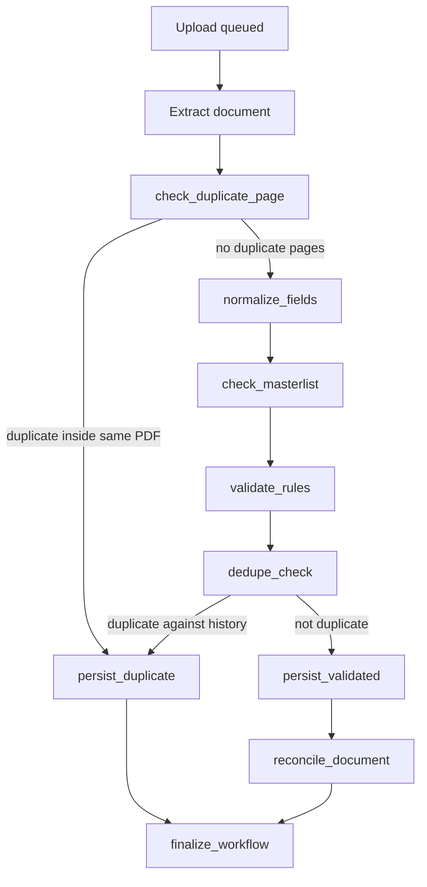

# Certificate Duplicate Checking Plan

This document explains the certificate duplicate-checking flow currently implemented in this repo so it can be reused in another branch.

## 1. Goal

Prevent the worker from saving the same BIR 2307 certificate twice.

The implementation currently checks duplicates in two layers:

1. Inside the current uploaded PDF.
2. Against previously processed uploads already stored in the database.

## 2. Where The Logic Lives

- Upload metadata capture: `backend/shared/src/utils/certificate-filename.ts`
- Worker entry/update of upload record: `backend/worker/src/consumer/messageHandler.ts`
- In-file duplicate page check: `backend/worker/src/langgraph/nodes/checkDuplicatePage.ts`
- Cross-upload duplicate check: `backend/worker/src/langgraph/nodes/dedupeCheck.ts`
- Fingerprint helpers: `backend/worker/src/langgraph/utils/dedupe.ts`
- Page text duplicate helper: `backend/worker/src/langgraph/utils/pageProcessing.ts`
- Duplicate persistence: `backend/worker/src/langgraph/nodes/persistDuplicate.ts`
- Success persistence used by future dedupe lookups: `backend/worker/src/langgraph/nodes/persistResults.ts`
- Error persistence also used by future dedupe lookups: `backend/worker/src/langgraph/nodes/persistValidationFail.ts`

## 3. High-Level Flow

## 4. Phase 1: Duplicate Pages Inside The Same Upload

### Objective

Catch cases where a single uploaded PDF contains the same certificate page more than once.

### Implementation

File: `backend/worker/src/langgraph/nodes/checkDuplicatePage.ts`

This node calls `findDuplicateCertificatePages(...)` from `backend/worker/src/langgraph/utils/pageProcessing.ts`.

### Rule

Only pages classified as `certificate` are checked.

For each certificate page:

1. Extract OCR text.
2. Normalize the text:
   - lowercase
   - remove non-alphanumeric separators
   - compress whitespace
3. Ignore very short text (`< 80` normalized characters).
4. Hash the normalized text with SHA-256.
5. If the same hash already appeared earlier in the same upload, mark the page as a duplicate of that earlier page.

### Result

If duplicates are found:

- worker route becomes `duplicate`
- reason code includes `duplicate_page_detected`
- `batchSummary.duplicatePageNumbers` is populated
- the workflow goes directly to `persist_duplicate`

This is an early guard before field normalization and historical matching.

## 5. Phase 2: Duplicate Check Against Previous Uploads

### Objective

Catch uploads that match something the system has already processed before.

### Implementation

File: `backend/worker/src/langgraph/nodes/dedupeCheck.ts`

This node runs after:

1. extraction
2. duplicate-page screening
3. normalization
4. masterlist lookup
5. validation

### Current Duplicate Signals

The node builds duplicate signals from four sources.

#### A. Same source file revision

Query:

- `document_results.sourceFileId == current sourceFileId`
- `document_results.revision == current revision`
- `document_results.outcome in ('Done', 'Duplicate')`

Reason code:

- `duplicate_source_file_revision`

Meaning:

The exact source file revision was already processed before, so the worker treats this as replay/idempotent duplicate protection.

#### B. Same original file name

Query:

- `intake_files.id != current uploadId`
- `intake_files.originalFileName == current originalFileName`

Reason code:

- `duplicate_original_file_name`

Meaning:

If another upload already used the same original file name, the worker flags it as duplicate.

Important:

This is filename equality only. It does not compare parsed filename parts one by one in the dedupe node.

#### C. Same uploaded file content

Query:

- `document_results.uploadId != current uploadId`
- `document_results.sourceHash == current source hash`

Reason code:

- `duplicate_uploaded_twice`

Meaning:

If the file hash matches a previously persisted result, the exact same uploaded content was submitted again.

#### D. Same normalized certificate data

Queries:

- page-level match against prior `document_results` rows where:
  - `documentKind == 'certificate'`
  - `dataFingerprint == current page fingerprint`
- batch-level match against prior `document_results` rows where:
  - `documentKind == 'upload'`
  - `dataFingerprint == current batch fingerprint`

Reason code:

- `duplicate_identical_data`

Meaning:

Even if the file name changed or the PDF was regenerated, the upload is treated as duplicate if the certificate data itself matches a previously stored certificate.

## 6. How Data Fingerprints Are Built

File: `backend/worker/src/langgraph/utils/dedupe.ts`

### Certificate Page Fingerprint

The worker builds a SHA-256 hash from a canonical JSON object made only from these normalized fields:

- `periodCovered`
- `periodEnd`
- `payeeName`
- `payeeTin`
- `payorName`
- `payorTin`
- `atcCode`
- `taxBase`
- `taxWithheld`

### Normalization Rules

- dates are normalized through the period parsing helpers
- TINs keep digits only
- ATC code is uppercased and stripped to alphanumeric
- money is parsed and fixed to 2 decimals
- text fields are trimmed, whitespace-collapsed, and lowercased

If all dedupe fields are empty after normalization, no fingerprint is produced.

### Batch Fingerprint

The worker also creates a batch fingerprint:

1. collect all page data fingerprints from certificate pages
2. remove duplicates
3. sort them
4. hash the resulting array with SHA-256

This lets the worker match a whole upload against a previously stored upload-level duplicate or error record.

## 7. Why Both Page-Level And Batch-Level Fingerprints Exist

They serve different purposes:

- Page fingerprint: match one certificate page to one previously stored certificate page.
- Batch fingerprint: match one whole upload result to a previously stored upload result.

This matters because successful uploads are stored as `documentKind = 'certificate'`, while duplicate/error batches are stored as `documentKind = 'upload'`.

## 8. What Gets Persisted For Future Duplicate Checks

### Successful Certificates

File: `backend/worker/src/langgraph/nodes/persistResults.ts`

For each validated certificate page, the worker stores:

- `documentKind = 'certificate'`
- `originalFileName`
- `sourceHash`
- `dataFingerprint`
- full payload with page-level `dedupe` info

This is the main historical source for future page-level duplicate matching.

### Duplicate Uploads

File: `backend/worker/src/langgraph/nodes/persistDuplicate.ts`

For a duplicate batch, the worker stores one upload-level `document_results` row with:

- `documentKind = 'upload'`
- `outcome = 'Duplicate'`
- `status = 'duplicate'`
- `originalFileName`
- `sourceHash`
- batch `dataFingerprint`
- `dedupe.dataFingerprints`
- `pages[*].dedupe.dataFingerprint`

This allows future uploads to match against previously rejected duplicate batches too.

### Validation Failures

File: `backend/worker/src/langgraph/nodes/persistValidationFail.ts`

Even failed uploads store:

- `documentKind = 'upload'`
- `originalFileName`
- `sourceHash`
- batch `dataFingerprint`
- page fingerprints inside the payload

This means the dedupe system can still learn from failed attempts when enough normalized data was produced.

## 9. Database Requirements

### Required Columns

On `document_results`:

- `original_file_name`
- `source_hash`
- `data_fingerprint`

On `intake_files`:

- `original_file_name`

Supportive metadata columns also exist on `intake_files`:

- `certificate_document_type`
- `certificate_issuer_short_name`
- `certificate_issuer_short_name_normalized`
- `certificate_recipient_short_name`
- `certificate_settlement_reference_number`
- `certificate_billing_month_mmyy`
- `certificate_date_uploaded`

Important:

These certificate metadata fields are useful operationally, but the current duplicate decision in `dedupeCheck.ts` does not use them directly.

### Required Indexes

The implementation currently relies on these indexes for lookup performance:

- `intake_files_original_file_name_idx`
- `document_results_original_file_name_idx`
- `document_results_source_hash_idx`
- `document_results_data_fingerprint_idx`
- `document_results_source_file_revision_idx`

Relevant migrations:

- `backend/worker/src/db/migrations/0003_certificate_metadata.sql`
- `backend/worker/src/db/migrations/0006_dedupe_lookup_columns.sql`
- `webapp/tax-track/src/lib/migrations/0004_complex_callisto.sql`
- `webapp/tax-track/src/lib/migrations/0008_dedupe_lookup_columns.sql`

## 10. Duplicate Output Shape

When a duplicate is detected, the worker returns:

- `decision.route = 'duplicate'`
- `decision.terminalStatus = 'Duplicate'`
- `decision.reasonCodes = [...]`
- invalid validation checks describing why it was marked duplicate
- `batchSummary.duplicatePageNumbers`
- optional `batchSummary.duplicateMatches`

`duplicateMatches` contains:

- `currentPageNumber`
- `existingPageNumber`
- `existingFileName`
- `matchedVia` (`certificate` or `upload`)

This is the most useful structure if you want to expose duplicate details in the UI.

## 11. Porting Checklist For Another Branch

If you want the same behavior in another branch, copy these pieces together.

### Minimum Required

1. Port `backend/worker/src/langgraph/utils/dedupe.ts`.
2. Port `backend/worker/src/langgraph/nodes/dedupeCheck.ts`.
3. Port `backend/worker/src/langgraph/nodes/checkDuplicatePage.ts`.
4. Port `backend/worker/src/langgraph/utils/pageProcessing.ts`.
5. Make sure the graph still routes:
   - `check_duplicate_page -> persist_duplicate`
   - `validate_rules -> dedupe_check`
   - `dedupe_check -> persist_duplicate | persist_validated`
6. Port persistence fields in:
   - `backend/worker/src/langgraph/nodes/persistResults.ts`
   - `backend/worker/src/langgraph/nodes/persistDuplicate.ts`
   - `backend/worker/src/langgraph/nodes/persistValidationFail.ts`
7. Port the DB columns and indexes from the dedupe-related migrations.

### Strongly Recommended

1. Port `backend/shared/src/utils/certificate-filename.ts`.
2. Keep `originalFileName`, `sourceHash`, and `dataFingerprint` populated in every persisted worker result.
3. Keep upload-level duplicate/error payloads storing page fingerprints, not just one batch fingerprint.
4. Port the tests in:
   - `backend/worker/src/langgraph/utils/dedupe.test.ts`
   - `backend/worker/src/langgraph/utils/pageProcessing.test.ts`

## 12. Current Behavior Notes

- The system is intentionally conservative: any one duplicate signal is enough to mark the upload as duplicate.
- Filename matching is broad and can catch renamed or re-sent files only if the name is the same.
- Data fingerprint matching is the more robust business-level duplicate rule.
- In-file duplicate page detection happens before normalization-based historical matching.
- Duplicate and error batches are still persisted so they can participate in future duplicate checks.

## 13. Recommended If You Rework This Later

If the next branch changes the duplicate rules, keep this priority order:

1. replay protection by `sourceFileId + revision`
2. exact file match by `sourceHash`
3. business duplicate match by normalized `dataFingerprint`
4. optional filename-based fallback

That keeps the strongest and least ambiguous checks first.
