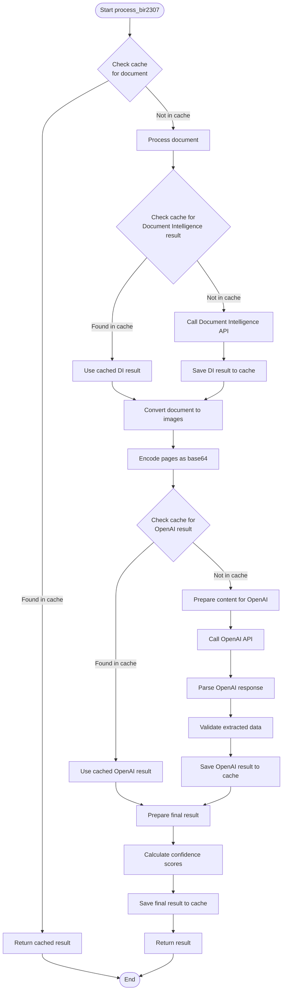

# BIR 2307 Extraction Service

This service extracts data from BIR 2307 forms using Azure Document Intelligence and Azure OpenAI.



## Features

- Extract data from BIR 2307 forms
- Caching mechanism for improved performance
- Confidence scores for extracted data
- Detailed logging of processing steps

## Caching Mechanism

The service implements a caching mechanism to improve performance when processing the same document multiple times:

1. **File Identification**: Each uploaded file is hashed to create a unique identifier.
2. **Cache Storage**: The service stores three types of data in the cache:
   - Raw Document Intelligence results
   - Raw OpenAI API responses
   - Final processed results

3. **Cache Structure**:

   ```
   cache/
   ├── document_intelligence/  # Raw Document Intelligence results
   ├── openai/                # Raw OpenAI API responses
   ├── results/               # Final processed results
   ```

4. **Cache Usage**: When a file is uploaded, the service:
   - Checks if the file has been processed before
   - If found in cache, returns the cached result immediately
   - If not found, processes the file and stores the results in cache

5. **Cache Control**: Caching can be enabled/disabled via the `CACHE_ENABLED` setting in the configuration.

## Logging

The service includes comprehensive logging to track the processing steps:

1. **Log Format**: Logs include timestamp, logger name, log level, and message.
2. **Log Levels**:
   - INFO: Normal operation logs (processing steps, cache hits/misses)
   - ERROR: Error conditions (file reading errors, API failures)
3. **Logged Information**:
   - Document processing steps
   - Cache operations (hits, misses, saves)
   - API calls to Azure services
   - Performance metrics (execution time)
   - File information (size, hash)

Logs are output to the console, making it easy to monitor the service operation in real-time.

## API Endpoints

### Extract BIR 2307 Data

```
POST /api/v1/extraction/bir2307
```

**Request**:

- File upload (PDF)

**Response**:

```json
{
  "data": {
    // Extracted data from the BIR 2307 form
  },
  "confidence": {
    // Confidence scores for the extracted data
  },
  "execution_time": 2.45,
  "cached": true // Indicates if the result was retrieved from cache
}
```

## Configuration

The service can be configured via environment variables:

- `AZURE_OPENAI_API_KEY`: Azure OpenAI API key
- `AZURE_OPENAI_ENDPOINT`: Azure OpenAI endpoint
- `DOCUMENT_INTELLIGENCE_API_KEY`: Azure Document Intelligence API key
- `DOCUMENT_INTELLIGENCE_ENDPOINT`: Azure Document Intelligence endpoint
- `CACHE_ENABLED`: Enable/disable caching (default: true)

## Development

### Setup

1. Install uv package manager

   ```
   curl -fsSL https://get.uv.dev | sh
   ```

2. Install dependencies

   ```
   cd v1_poc
   uv pip install -r pyproject.toml
   ```

3. Create a `.env` file with your Azure credentials. Copy the `.env.sample` file to `.env` and fill in your credentials.

4. Run the service

   ```
   cd v1_poc
   uv run uvicorn app.main:app --host 0.0.0.0 --port 8000
   ```

### Project Structure

```
v1_poc/
├── app/
│   ├── api/                    # API endpoints
│   ├── core/                   # Core configuration
│   ├── models/                 # Data models
│   ├── services/               # Business logic
│   │   ├── cache_service.py    # Caching functionality
│   │   └── document_service.py # Document processing
│   ├── utils/                  # Utility functions
│   │   ├── file_hash.py        # File hashing utility
│   │   ├── logger.py           # Logging utility
│   │   └── stopwatch.py        # Performance measurement
│   └── main.py                 # Application entry point
└── modules/                    # Shared sample models/utilities
```
