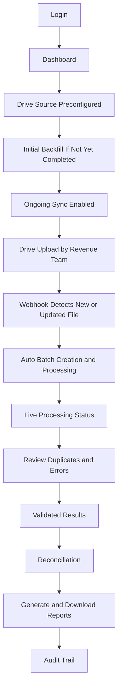

# User Journey - Project TaxTrack

This journey reflects the production operating model where source 2307 files are uploaded to Google Drive, not directly uploaded to the TaxTrack platform.

## 1) Login and Dashboard

- User signs in and lands on operations dashboard.
- Dashboard shows recent batches, queue status, error counts, and reconciliation progress.

## 2) Drive Source Is Preconfigured (Current Assumption)

- The Drive connection and source folder are preconfigured by a Super Admin (one-time).
- Regular users do not need to connect, select, or manage the Drive source from the dashboard.
- Dashboard can still show a read-only indicator that ingestion is active (folder name/ID, last sync time, webhook health).

## 3) Initial Backfill (Existing Files)

- System scans the selected Drive folder for existing files and queues them for processing.
- Backfill progress is visible in the dashboard (imported count, queued, processed, errors).
- After backfill completes, system runs a short catch-up sync to avoid missing updates that happened during the scan.

## 4) Revenue Team Uploads to Google Drive

- Revenue team continues their current behavior: upload/download files in Google Drive.
- No manual source upload is required inside TaxTrack.

## 5) Automatic Intake via Webhook

- Drive webhook notifies TaxTrack of new or modified files.
- Intake service validates the event and reads change tokens.
- Matching files are queued for processing.

## 6) Live Processing Visibility

- Users monitor stages: queued -> OCR -> extraction -> validation -> reconciliation -> done/failed.
- Each file has timestamps, status reason, and confidence information.

## 7) Duplicate and Error Handling

- Duplicate files are automatically segregated and tagged with reason.
- Invalid records (missing fields, signature/printed name issues, ATC/variance failures) move to error queue.
- Users review details and decide reprocess/escalation actions.

## 8) Validated Outputs and Storage

- Valid files are renamed using `Co.Name_TIN_PeriodEnd_Sequence`.
- Processed artifacts are stored in S3 and/or Azure Blob Storage.
- Structured extraction results are persisted for downstream reporting.

## 9) Reconciliation

- Revenue book data is loaded for reconciliation.
- System matches extracted CWT details against book records.
- Monthly and quarterly reconciliation statuses are computed.

## 10) Reporting and Export

- User generates consolidated reconciliation reports.
- Reports are downloadable and retained in cloud storage.

## 11) Audit and Support

- All ingestion, processing, and user actions are logged for traceability.
- Support workflow follows agreed hypercare and maintenance commitments.
