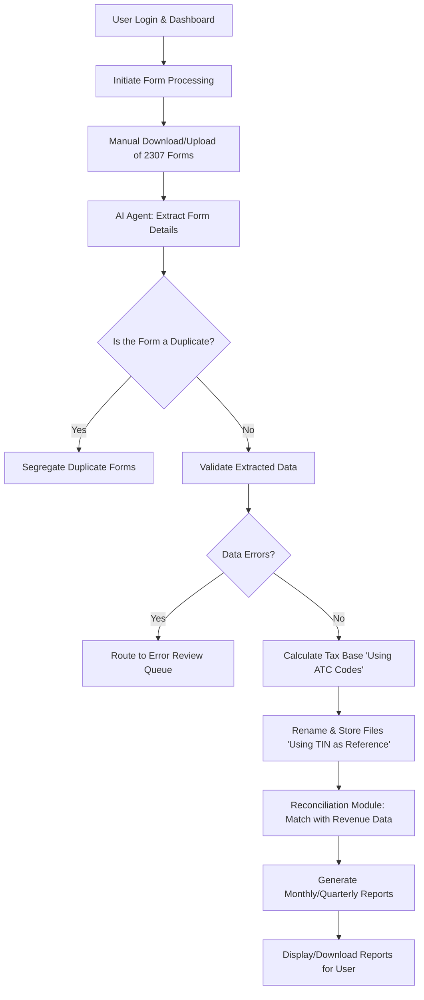
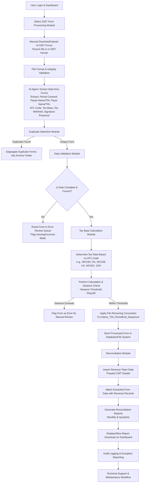

# Workflow Diagram

## High Level Flow

```mermaid
flowchart TD
    A["User Login & Dashboard"] --> B["Initiate Form Processing"]
    B --> C["Manual Download/Upload of 2307 Forms"]
    C --> D["AI Agent: Extract Form Details"]
    D --> E{"Is the Form a Duplicate?"}
    E -- Yes --> F["Segregate Duplicate Forms"]
    E -- No --> G["Validate Extracted Data"]
    G --> H{"Data Errors?"}
    H -- Yes --> I["Route to Error Review Queue"]
    H -- No --> J@{ label: "Calculate Tax Base 'Using ATC Codes'" }
    J --> K@{ label: "Rename & Store Files 'Using TIN as Reference'" }
    K --> L["Reconciliation Module: Match with Revenue Data"]
    L --> M["Generate Monthly/Quarterly Reports"]
    M --> N["Display/Download Reports for User"]
    J@{ shape: rect}
    K@{ shape: rect}
```

## Low Level Flow

```mermaid
flowchart TD
    A[User Login & Dashboard] --> B[Select 2307 Form Processing Module]
    B --> C[Manual Download/Upload of 2307 Forms<br/>'Ensure file is in 2307 format']
    C --> D[File Format & Integrity Validation]
    D --> E[AI Agent: Extract Data from Forms<br/>'Extract: Period Covered, Payee Name/TIN, Payor Name/TIN,<br/>ATC Code, Tax Base, Tax Withheld, Signature Presence']
    E --> F[Duplicate Detection Module]
    F -- Duplicate Found --> G[Segregate Duplicate Forms into Archive Folder]
    F -- Unique Form --> H[Data Validation Module]
    H --> I{Is Data Complete & Correct?}
    I -- No --> J[Route Form to Error Review Queue<br/>'Flag missing/incorrect fields']
    I -- Yes --> K[Tax Base Calculation Module]
    K --> L[Determine Tax Rate Based on ATC Code<br/>'e.g., WC160: 2%, WC158: 1%, WC051: 15%']
    L --> M[Perform Calculation & Variance Check<br/>'Variance Threshold: Php100']
    M -- Variance Exceeds --> N[Flag Form as Error for Manual Review]
    M -- Within Threshold --> O[Apply File Renaming Convention<br/>'Co.Name_TIN_PeriodEnd_Sequence']
    O --> P[Store Processed Form in Database/File System]
    P --> Q[Reconciliation Module]
    Q --> R[Import Revenue Team Data<br/>'Prepaid CWT Details']
    R --> S[Match Extracted Form Data with Revenue Records]
    S --> T[Generate Reconciliation Reports<br/>'Monthly & Quarterly']
    T --> U[Display/Allow Report Download on Dashboard]
    U --> V[Audit Logging & Exception Reporting]
    V --> W[Technical Support & Maintenance Workflow]
```