# TaxTrack Updated Structural Diagram

This client-facing diagram reflects the current deployed application structure as of August 2026. It covers the TaxTrack web application, private AWS processing and data services, document storage and messaging, merge and retention workloads, email delivery, Gemini extraction, and LangSmith observability.

## Scope Notes

- The browser uploads PDFs directly to versioned S3 storage using presigned URLs issued by the authenticated web application.
- SQS decouples upload intake from the EC2 worker fleet; repeatedly failing messages move to the dead-letter queue.
- RDS PostgreSQL is the system of record for users, intake state, extraction results, reconciliation, merge jobs, and audit history.
- Gemini is the sole AI extraction provider. LangSmith receives redacted workflow traces, while CloudWatch receives platform logs and operational metrics.
- AWS Batch on Fargate handles large certificate merge jobs. EventBridge and the retention Lambda handle scheduled cleanup.
- Solid connectors show request, data, and document movement. Dashed connectors show logs, metrics, and traces.
- The legacy FastAPI proof of concept and local-only development services are outside this production diagram.

Editable source: [`taxtrack-structural-diagram.mmd`](assets/taxtrack-structural-diagram.mmd)

Shareable exports:

- [`taxtrack-structural-diagram.svg`](assets/taxtrack-structural-diagram.svg)
- [`taxtrack-structural-diagram.png`](assets/taxtrack-structural-diagram.png)
