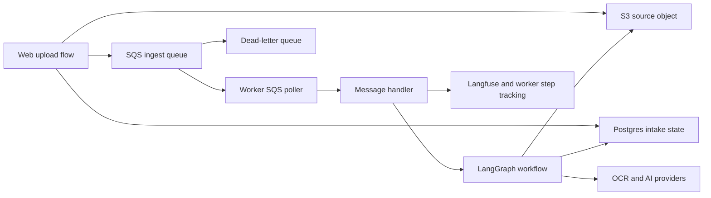
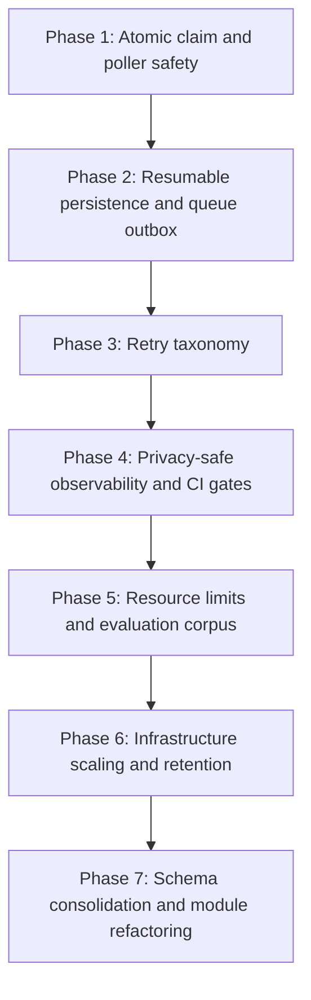

# Worker and System Improvement Assessment

**Assessment date:** July 13, 2026  
**Status:** Analysis only; no implementation is included in this document.  
**Primary scope:** `backend/worker`, with the upload-to-queue, persistence, observability, CI/CD, retention, and infrastructure seams that affect worker correctness.

## Executive Summary

The extraction pipeline has substantial domain handling, validation, duplicate detection, and automated test coverage. The main risk is now the reliability boundary around that pipeline rather than the extraction logic itself.

The worker should not be scaled horizontally or given higher concurrency until the following three issues are resolved:

1. A queue event is claimed atomically so that only one worker can run it at a time.
2. Received SQS messages are protected by visibility heartbeats while waiting for local capacity.
3. Database and S3 persistence is resumable and does not keep a database transaction open across network calls.

After those controls, the next priorities are typed retry behavior, privacy-safe per-job tracing, enforceable worker tests in CI, resource controls, production infrastructure hardening, and version-aware S3 retention.

## Scope and Method

This assessment reviewed the current repository working tree, including uncommitted changes, across:

- SQS polling, message handling, visibility extension, and idempotency
- LangGraph orchestration and node-level tracking
- OCR/provider calls and document memory usage
- successful, validation-failure, and duplicate persistence paths
- upload completion and queue publishing
- worker tests, package scripts, CI, deployment, and container configuration
- EC2, RDS, S3, IAM, logging, and retention infrastructure
- worker-owned schema, migrations, and lookup queries

The review was static except for local verification commands. It did not inspect the live UAT or production AWS configuration, queue state, database state, or provider quotas.

## Current Architecture

The design is appropriate for asynchronous document processing, but correctness currently depends on several non-atomic operations across SQS, Postgres, S3, and external providers.

## What Is Already Strong

- The worker stages extraction, normalization, validation, masterlist lookup, duplicate checking, and persistence explicitly.
- `document_results.upload_id` provides a useful final database uniqueness guard.
- SQS visibility extension, a dead-letter queue, worker health endpoints, job records, and step records already exist.
- The current worker test files cover many normalizer, OCR fallback, validation, and dedupe cases.
- In the reviewed working tree, worker, shared, and infrastructure typechecks passed.
- Running all worker `*.test.ts` files directly produced 222 passing tests.

These are good foundations. The recommended work should preserve the extraction behavior while strengthening execution and persistence around it.

## Priority Summary

| Priority | Improvement | Primary failure prevented |
| --- | --- | --- |
| P0 | Atomic event claim with a lease | Two workers performing the same OCR and persistence work |
| P0 | Capacity-aware SQS receive and heartbeat | Invisible messages expiring before processing starts |
| P0 | Resumable DB/S3 persistence | Partial artifacts, rolled-back metadata, and unsafe retries |
| P0 | Version-aware retention | Deleted database history while S3 versions remain or deletion fails |
| P1 | Retry and error taxonomy | Permanent errors retrying and transient errors becoming terminal |
| P1 | Per-job, privacy-safe observability | Cross-linked traces and sensitive payload capture |
| P1 | Worker resource limits and streaming | Memory exhaustion and provider request amplification |
| P1 | Enforced worker tests and deploy gates | Regressions reaching an environment despite local tests |
| P1 | Production runtime hardening | Single-host failure, weak secrets handling, and missing alarms |
| P2 | Shared schema and indexed normalized lookups | Migration drift and lookup degradation as data grows |

## Detailed Findings

### P0. Make the Idempotency Claim Atomic

**Evidence**

The message handler reads `worker_idempotency`, inserts a pending row using `onConflictDoNothing`, and then continues without proving that this worker inserted or owns the claim. See [`messageHandler.ts`](../../backend/worker/src/consumer/messageHandler.ts).

The final uniqueness constraint on `document_results.upload_id` can stop a second final row, but it does not stop duplicate OCR calls, external provider cost, S3 writes, status changes, or worker step records.

**Risk**

Two worker processes, or two concurrent deliveries in one process, can both observe no terminal record and process the same event. This becomes more likely when concurrency or instance count increases.

**Recommended design**

- Claim the event with one atomic database operation.
- Store a claim owner, lease expiration, attempt number, and last heartbeat.
- Continue only when the claim operation returns ownership to the current worker.
- Permit takeover only when the previous lease has expired.
- Treat a completed claim as an acknowledged replay and skip the graph.
- Use stable event/job identity rather than `Date.now()` as part of the correctness contract.
- Define one canonical state machine for pending, running, succeeded, retryable failure, terminal failure, and duplicate.

**Acceptance criteria**

- Two handlers invoked concurrently with the same event cause exactly one graph execution.
- A second handler skips an event with a completed claim.
- A crashed worker's expired lease can be taken over safely.
- A live worker renews its lease during long documents.

### P0. Align SQS Prefetch with Available Capacity

**Evidence**

[`sqsPoller.ts`](../../backend/worker/src/consumer/sqsPoller.ts) can receive up to five messages and then wait for a local concurrency slot before starting `processSingleMessage`. [`visibilityHeartbeat.ts`](../../backend/worker/src/consumer/visibilityHeartbeat.ts) starts visibility extension only after processing begins.

Shutdown sets the poller state but does not cancel an outstanding long poll, and malformed messages are left for repeated redelivery.

**Risk**

A received message can remain invisible without a heartbeat while it waits behind active work. If the wait exceeds the visibility timeout, another worker can receive it. Shutdown can also admit new work after draining starts.

**Recommended design**

- Receive no more messages than the number of free processing slots.
- Alternatively, start a visibility heartbeat as soon as a message is received, including while locally queued.
- Stop or abort the outstanding receive call when draining.
- Stop accepting new messages before waiting for in-flight jobs.
- Classify malformed messages as poison messages with explicit DLQ or terminal handling.
- Add exponential backoff with jitter for receive failures.
- Record visibility-extension failures as metrics and structured warnings.

**Acceptance criteria**

- No received message waits without visibility protection.
- Draining never starts a message received after shutdown begins.
- A heartbeat failure is observable.
- A poison message follows a bounded, documented path to the DLQ.

### P0. Make Persistence Resumable Across Postgres and S3

**Evidence**

[`persistResults.ts`](../../backend/worker/src/langgraph/nodes/persistResults.ts) performs S3 `PutObject` calls while a database transaction and advisory lock are open. The validation-failure and duplicate paths in [`persistValidationFail.ts`](../../backend/worker/src/langgraph/nodes/persistValidationFail.ts) and [`persistDuplicate.ts`](../../backend/worker/src/langgraph/nodes/persistDuplicate.ts) use different ordering and are not one database transaction.

The successful path can therefore hold a database connection across remote I/O. Other paths can write an S3 object and then fail before database metadata is durable. Tracking failures after business persistence can also make an otherwise completed job appear failed.

**Risk**

- Long transactions and pool pressure under slow S3 calls
- Orphaned S3 artifacts after database rollback
- Database rows pointing to missing or differently named artifacts
- Retried work colliding with artifacts created by an earlier partial attempt
- A successful business result being reclassified as failed because step tracking failed

**Recommended design**

- Define one persistence state machine shared by success, validation failure, and duplicate outcomes.
- Keep remote network calls outside database transactions.
- Use deterministic artifact keys and idempotent writes.
- Persist an artifact intent/outbox, perform S3 writes, then atomically finalize database metadata.
- Record enough state to resume after any individual write fails.
- Make diagnostic step tracking best-effort or write it through a separate durable telemetry path.
- Reconcile incomplete persistence records asynchronously.
- Make final artifact fields semantically consistent across all outcomes.

**Acceptance criteria**

- Failure after any S3 or database operation can be retried without duplicate results or corrupt status.
- Database transactions do not span external network calls.
- A telemetry insert failure cannot reverse a completed document result.
- A reconciliation process can identify and repair incomplete artifacts.

### P0. Correct Retention for a Versioned S3 Bucket

**Evidence**

The S3 bucket is versioned in [`data.ts`](../../backend/infra/data.ts). The batch-retention implementations delete objects by key but do not enumerate and delete all object versions and delete markers. See [`batch-retention.ts`](../../backend/infra/lambda/batch-retention.ts) and the web application's retention implementation.

The retention flow can continue purging database rows when some object deletions fail.

**Risk**

Deleting by key in a versioned bucket creates a delete marker while older object versions remain billable and recoverable. If the database rows and audit context are removed after an S3 failure, the system can lose the durable manifest needed to retry cleanup.

**Recommended design**

- Enumerate and delete every version and delete marker for the retained keys.
- Add the exact IAM permissions required for listing and deleting versions.
- Do not finalize database deletion until object deletion succeeds.
- Preserve a durable retry manifest for partial failures.
- Add retention metrics for keys, versions, bytes, failures, and retry age.

### P1. Introduce a Typed Retry and Error Taxonomy

**Evidence**

[`mistralClient.ts`](../../backend/worker/src/langgraph/services/mistralClient.ts) treats non-success HTTP statuses uniformly and does not apply bounded retry/backoff or `Retry-After`. [`loadInput.ts`](../../backend/worker/src/langgraph/nodes/loadInput.ts) and [`checkMasterlist.ts`](../../backend/worker/src/langgraph/nodes/checkMasterlist.ts) can turn infrastructure/database errors into terminal document validation outcomes.

**Risk**

The system cannot reliably distinguish a bad document from a temporary provider, S3, network, or database failure. This causes unnecessary retries, missed retries, misleading user-facing statuses, and retry storms.

**Recommended design**

Define typed outcomes at the worker boundary:

- permanent input error
- terminal business/validation result
- retryable provider throttling or timeout
- retryable S3/database/network failure
- duplicate/replay success
- poison event contract failure

Use bounded exponential backoff with jitter, honor provider retry hints, cap total attempts and elapsed time, and persist the reason each retry was selected.

### P1. Isolate and Sanitize Observability Per Job

**Evidence**

[`messageHandler.ts`](../../backend/worker/src/consumer/messageHandler.ts) creates one Langfuse callback handler and reuses it across concurrent messages. The callback object maintains trace state. The graph state can contain source base64, OCR output, names, TINs, and normalized result data. [`checkMasterlist.ts`](../../backend/worker/src/langgraph/nodes/checkMasterlist.ts) also logs normalized identity values.

**Risk**

- Concurrent jobs can be attached to the wrong trace.
- Large payloads and personally identifiable or tax information can be copied into traces and logs.
- Trace buffers may not flush during shutdown.

**Recommended design**

- Create an independent trace context for every queue event.
- Trace metadata, timings, decisions, model identifiers, request counts, and error classes rather than full graph state.
- Redact TINs, names, source base64, raw OCR, and provider payloads by default.
- Define an explicit diagnostic opt-in with retention and access rules if full payload capture is ever required.
- Flush trace buffers during graceful shutdown.
- Add correlation IDs consistently across SQS, worker jobs, artifacts, and traces.

### P1. Bound Memory, CPU, and Provider Calls Per Document

**Evidence**

[`loadInput.ts`](../../backend/worker/src/langgraph/nodes/loadInput.ts) reads the full source object and stores it as base64. [`pageProcessing.ts`](../../backend/worker/src/langgraph/utils/pageProcessing.ts) splits a full PDF into page buffers. [`extractDocument.ts`](../../backend/worker/src/langgraph/nodes/extractDocument.ts) can retain per-page base64 and make multiple zone OCR calls. [`mistralClient.ts`](../../backend/worker/src/langgraph/services/mistralClient.ts) creates additional base64 and JSON copies.

[`signatureVisualDetector.ts`](../../backend/worker/src/langgraph/utils/signatureVisualDetector.ts) can render a full page at high DPI into an uncompressed raster before cropping. File-size limits in the web application do not independently protect the worker from messages published by another source.

**Risk**

One large or malformed PDF can consume substantial memory and provider capacity. Process-level concurrency multiplies the peak. Increasing page parallelism before applying limits would amplify the problem.

**Recommended design**

- Enforce worker-side maximum source bytes, page count, rendered pixels, provider calls, and total job duration.
- Avoid base64 in long-lived graph state where buffers, streams, or temporary files are sufficient.
- Render only the required signature crop at a lower, independently configured DPI and grayscale where valid.
- Add a worker-wide semaphore for provider calls.
- Measure per-job peak RSS, render memory, page count, provider calls, and elapsed time.
- Add bounded page parallelism only after the resource envelope is measured and enforced.
- Build a labeled corpus of representative real PDFs to measure accuracy, latency, and cost before changing OCR heuristics.

### P1. Make Worker Tests a Required CI and Deployment Gate

**Evidence**

[`backend/worker/package.json`](../../backend/worker/package.json) has no `test` script, and its TypeScript configuration excludes test files. The root recursive test command therefore does not execute worker tests. [`backend-ci.yml`](../../.github/workflows/backend-ci.yml) typechecks packages but does not run the worker test suite. Deployment workflows build and deploy independently of those checks.

**Risk**

The repository contains meaningful tests, but a normal package or CI command can report success without executing them. A deployment is not guaranteed to be based on a tested revision.

**Recommended design**

- Add an explicit worker test script that discovers all `*.test.ts` files.
- Typecheck test code in a dedicated test configuration.
- Make worker tests, worker typecheck, shared typecheck, and infrastructure typecheck required CI jobs.
- Gate deployments on the exact tested commit and image digest.
- Add high-value consumer and persistence tests:
  - concurrent claim of the same event
  - stale lease takeover
  - prefetch and heartbeat behavior
  - graceful drain
  - partial S3/database failure and resume
  - poison message handling
  - provider retry classification

### P1. Harden the Worker Runtime and Production Infrastructure

**Evidence**

[`compute-worker.ts`](../../backend/infra/compute-worker.ts) provisions one EC2 worker instance. Secrets are delivered through instance user data/systemd environment configuration. The worker container runs source through `tsx`, includes development dependencies, runs as root, and does not declare a container health check or explicit resource limits. See [`Dockerfile`](../../backend/worker/Dockerfile).

[`sizing.ts`](../../backend/infra/sizing.ts) currently defines a production worker/database profile smaller than the UAT profile. [`client.ts`](../../backend/worker/src/db/client.ts) disables TLS certificate verification for remote Postgres and does not define explicit pool and query timeouts.

The repository does not define comprehensive alarms for queue age, DLQ messages, worker liveness, instance health, database pressure, disk, or memory.

**Risk**

- The worker is a single-instance failure domain.
- Scale-out is unsafe until atomic claiming is fixed.
- Secrets can be exposed through host configuration surfaces.
- Host updates and runtime behavior are less deterministic.
- Resource exhaustion and backlog growth can remain unnoticed.

**Recommended sequence**

After the P0 worker correctness changes:

1. Build a production image from a pinned, tested artifact; run as a non-root user.
2. Apply container memory/CPU limits, log rotation, health checks, and graceful termination time.
3. Move secrets to SSM Parameter Store or Secrets Manager with runtime retrieval and rotation.
4. Enforce IMDSv2, encrypted/sized root storage, deterministic host/bootstrap configuration, and least-privilege IAM.
5. Configure verified RDS TLS, explicit connection-pool limits, connection/query timeouts, and pool error handling.
6. Add queue-age, DLQ, worker, EC2/container, RDS, disk, and memory alarms.
7. Revisit production sizing with measured workload data.
8. Move to an Auto Scaling Group or ECS service and scale on queue age/depth once multi-worker safety is proven.

### P1. Make Upload-to-Queue Publishing Recoverable

**Evidence**

The upload completion flow in [`intake-server.ts`](../../webapp/tax-track/src/lib/intake-server.ts) updates database state, publishes to SQS, then updates the database with the queued state/message ID.

**Risk**

If SQS publishing succeeds but the final database update fails, a retry can publish the same event again while the UI may show a failed or stuck queue state. Atomic worker idempotency limits the processing damage but does not repair upload state.

**Recommended design**

- Write an upload-complete event to a database outbox in the same transaction as intake state.
- Publish asynchronously and mark the outbox record delivered.
- Reconcile stale `sending` and undelivered outbox rows.
- Use the stable event ID as the worker idempotency key.

### P2. Consolidate Schema Ownership and Optimize Lookup Paths

**Evidence**

The web application owns the canonical deployment migration chain, while the worker contains a separate partial schema/migration history. Functional TIN cleanup and compact-name matching in masterlist queries prevent ordinary indexes from being used effectively. ATC rates are loaded broadly for each document.

Relevant areas include [`backend/worker/src/db`](../../backend/worker/src/db) and [`webapp/tax-track/src/lib/migrations`](../../webapp/tax-track/src/lib/migrations).

**Risk**

Duplicate schema definitions can drift in constraints, indexes, timestamps, and relationships. Lookup cost will grow with masterlist/entity history, and broad per-document reference reads waste database capacity.

**Recommended design**

- Establish one migration owner and one shared database schema package.
- Remove or clearly disable package-local migration commands that are not authoritative.
- Store or index normalized TIN and normalized compact-name values used by worker lookups.
- Inspect query plans with production-like masterlist sizes before choosing exact indexes.
- Cache ATC reference data with a bounded TTL or version-based invalidation.
- Replace free-form status strings with shared enums/state transitions and database constraints where practical.

### P2. Reduce Large-Module Change Risk

**Evidence**

The normalizer post-processing and signature visual detection modules contain many responsibilities, hard-coded heuristics, and document-specific rules.

**Risk**

Large modules increase review cost and make it difficult to identify which rule changed accuracy for a specific document family. Synthetic unit tests alone can reinforce existing assumptions without showing real-world regressions.

**Recommended design**

- Split rules by field or document region behind stable interfaces.
- Keep rule ordering explicit and explain why each recovery rule is safe.
- Record which rule produced or changed a field in diagnostic metadata.
- Maintain a versioned, labeled, privacy-controlled real-PDF evaluation corpus.
- Compare accuracy, false repair rate, latency, provider calls, and peak memory for every material extraction change.

## Recommended Delivery Sequence

### Phase 1: Execution Ownership

- Implement an atomic lease-based event claim.
- Make SQS receive capacity-aware and drain-safe.
- Add concurrent-delivery, lease, heartbeat, poison-message, and shutdown tests.

**Gate:** one event produces one workflow execution under concurrent delivery and worker restart scenarios.

### Phase 2: Durable Side Effects

- Define the shared persistence state machine.
- Move S3 work outside database transactions.
- Add resumable artifact intents and incomplete-work reconciliation.
- Add an upload outbox and stuck-queue reconciliation.

**Gate:** every injected failure point can be retried without duplicate business results or lost artifacts.

### Phase 3: Failure Policy

- Add typed error classes and retry decisions.
- Add bounded backoff, jitter, attempt limits, and deadlines.
- Align persisted job/upload/result statuses with the error taxonomy.

**Gate:** permanent input errors do not retry, and simulated transient provider/storage/database errors do retry predictably.

### Phase 4: Operational Safety

- Isolate and redact per-message traces.
- Add structured metrics and shutdown flushing.
- Make worker tests and typechecks required deployment gates.

**Gate:** a trace cannot receive events from another concurrent job, sensitive document content is absent by default, and an untested image cannot deploy.

### Phase 5: Performance Envelope

- Enforce worker-side document limits and provider-call limits.
- Reduce base64/raster copies and measure peak resource use.
- Establish the real-document evaluation corpus and baseline.

**Gate:** the maximum supported document shape has a measured CPU, memory, latency, accuracy, and provider-cost envelope.

### Phase 6: Production Platform

- Add alarms, health/readiness semantics, secrets management, TLS verification, resource limits, and retention repair.
- Correct production sizing based on measurements.
- Introduce multi-instance orchestration and queue-driven scaling.

**Gate:** a worker instance can be replaced without loss or duplicate processing, backlog/health failures page operators, and retention removes every intended object version before deleting database history.

### Phase 7: Maintainability

- Consolidate schema/migrations.
- Add normalized lookup fields/indexes and reference-data caching.
- Split large heuristic modules while preserving evaluation results.

## Suggested Operational Metrics

At minimum, publish and alarm on:

- SQS visible, not-visible, oldest-message-age, receive, delete, and DLQ counts
- jobs claimed, lease conflicts, lease takeovers, successes, duplicates, retryable failures, terminal failures
- attempt count and end-to-end duration by outcome
- node duration, provider duration/status/retry, and provider calls per document
- document bytes, page count, rendered pixels, peak worker RSS, and event-loop delay
- database pool active/idle/waiting, transaction duration, query timeout, and persistence reconciliation backlog
- artifact intent age, upload outbox age, retention failure count, and remaining object-version count
- worker readiness, drain duration, process restart count, host/container disk, memory, and CPU

Use stable event, upload, batch, worker job, and trace identifiers as dimensions where cardinality and privacy policy permit.

## Verification Performed During This Assessment

- `backend/worker`: `pnpm typecheck` passed.
- `backend/shared`: `pnpm typecheck` passed.
- `backend/infra`: `pnpm typecheck` passed.
- Direct execution of all worker `*.test.ts` files passed: 222 tests.
- `git diff --check` passed.
- `pnpm --filter @taxtrack/worker test` exited without running tests because no worker `test` script is defined.

## Limitations

- The repository had pre-existing modified and untracked files during the review; this assessment describes that working tree, not only the latest commit.
- No live AWS, SQS, RDS, S3, Langfuse, or provider configuration was inspected.
- No production-like load test, fault-injection test, memory profile, provider-quota check, or real-document accuracy benchmark was performed.
- Exact infrastructure sizing should follow measured throughput, latency, memory, and burst-volume evidence rather than repository defaults alone.

