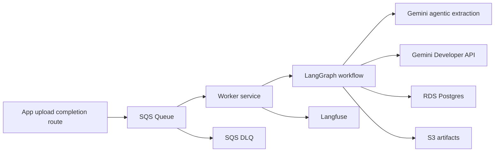

# Async Worker Plan - SQS Event Processing

This document describes the worker that consumes upload intake events from SQS and runs the BIR 2307 workflow.

## Goals

- Consume one queue message per completed upload.
- Run extraction, normalization, validation, dedupe, and persistence in a retry-safe worker.
- Persist batch, file, job, and step state for operational visibility.
- Keep the runtime simple: health endpoints plus a background SQS poller.

## High-Level Flow

## Queue Contract (v1)

Each message carries a `DocumentIngestEventV1` payload with:

- `eventId`
- `traceId`
- `source`
- `batchId`
- `uploadId`
- `sourceFileId`
- `revision`
- `originalFileName`
- `mimeType`
- `sizeBytes`
- `artifactUri`
- `uploadedByUserId`
- `uploadedAt`
- `receivedAt`

## Worker Responsibilities

1. Parse and validate the queue payload.
2. Apply idempotency using event identity.
3. Load the source artifact from S3.
4. Run extraction and normalization.
5. Apply validation and duplicate checks.
6. Persist artifacts, results, and worker step records.
7. Refresh intake file and batch status.
8. Delete the queue message on success.

## Persistence

- `worker_jobs`: one row per processing run.
- `worker_job_steps`: step-level timing and outcomes.
- `worker_idempotency`: replay protection.
- `document_results`: one current business outcome per uploaded file.
- `document_extraction_attempts`: internal cost and reliability history for every acquired worker claim.
- `intake_batches` and `intake_files`: upload-side operational state.

## Failure Handling

- Retries rely on SQS visibility timeout and redelivery.
- Permanent failures remain visible through persisted file and worker status.
- Step-level logs make it clear where a file stopped.
