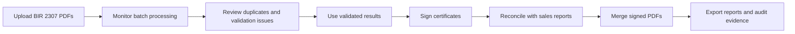

# TaxTrack User Manual

Last updated: August 4, 2026

This manual is for TaxTrack users who upload, review, sign, reconcile, merge, export, or administer BIR 2307 certificate workflows.

## 1. What TaxTrack Does

TaxTrack helps teams process BIR 2307 PDF certificates from intake to export.

The standard workflow is:

Use TaxTrack to:

- Upload multiple BIR 2307 PDFs into a batch.
- Track each file from upload through worker processing.
- Review validation failures, duplicates, and attention items.
- View and update extracted certificate fields when permitted.
- Sign validated certificates and download signed PDFs.
- Export BIR 2307 workbooks and reconciliation files.
- Reconcile certificate data against sales reports.
- Merge signed PDFs into filing-ready batches.
- Review audit logs and administer users when permitted.

## 2. Roles And Access

Your visible pages and actions depend on your role, team, and export grants.

| Role        | Main access                                                                                                                                           |
| ----------- | ----------------------------------------------------------------------------------------------------------------------------------------------------- |
| Super admin | Full access, including user status changes, user deletion, settings, audit, uploads, exports, and override decisions.                                 |
| Admin       | Full operational access, including settings, user creation and edits, uploads, exports, audit, and override decisions.                                |
| Editor      | Operational access for upload, review, reconciliation, and exports when export grants are enabled. No settings, audit, or override queue access.      |
| Viewer      | Read-only monitoring for dashboards, batches, issues, validated results, reconciliation, documents, and available reports. No upload or admin access. |

Additional permissions:

- PDF exports require admin access or a PDF export grant.
- Excel exports require admin access or an Excel export grant.
- Certificate signing is limited to users on the Tax Manager team.
- Validated certificate field edits are available to admins or the user who owns the certificate, unless the certificate is already signed.

If a page or button is missing, you probably do not have the required permission.

## 3. First Sign-In

1. Open TaxTrack and sign in with the account provided by an admin.
2. If TaxTrack asks you to change your password, complete the password change before continuing.
3. Open Account from the user menu to confirm your role, team, and export access.
4. If you sign certificates, confirm your signature profile before your first signing task.

Accounts are provisioned by admins. Public self-signup is disabled.

## 4. Main Navigation

TaxTrack navigation is grouped by workflow step.

| Navigation group | Pages                                     | Use for                                                                                   |
| ---------------- | ----------------------------------------- | ----------------------------------------------------------------------------------------- |
| Overview         | Dashboard                                 | Overall health, recent activity, and quick checks.                                        |
| Step 1: Intake   | Upload, Batches                           | Upload certificates, monitor batches, close batches, and open batch details.              |
| Step 2: Review   | Issues, Validated Results, Reconciliation | Resolve processing exceptions, inspect successful certificates, and reconcile sales data. |
| Step 3: Merge    | PDF Merge                                 | Merge signed 2307 PDFs into filing-ready PDF batches.                                     |
| Admin            | Override Requests, Audit Log, Settings    | Approvals, audit evidence, and user administration.                                       |

Most pages also include a Help menu with a guided tour or support contact option.

## 5. Dashboard

Use Dashboard as your daily starting point.

> Image placeholder: Dashboard overview with period selector, metric band, recent batches, and alerts.

What to check:

- Recent batch activity.
- Certificate processing totals.
- Duplicates, failures, and attention counts.
- Reconciliation health.
- Current entity and reporting period context.

Recommended use:

1. Confirm the selected period and entity scope.
2. Check whether any batches need attention.
3. Open the relevant batch, issue, validated result, or reconciliation result from the dashboard tables.
4. Refresh the dashboard when you need the latest state.

## 6. Upload Certificates

Use Upload to create or resume your current open intake batch.

> Image placeholder: Upload Intake page showing entity selection, selected PDFs, upload tray, and current batch status.

Upload rules:

- Upload PDF files only.
- Each PDF must contain one BIR 2307 certificate.
- Each file must be 20 MiB or smaller.
- Multiple PDFs can be added to one batch over time.
- Each file uploads, queues, and processes independently.
- TaxTrack allows one open batch per user. Returning to Upload resumes your current open batch.

To upload files:

1. Go to Upload.
2. Select the entity if the batch is not already locked to one.
3. Choose one or more BIR 2307 PDF files.
4. Select Upload selected.
5. Keep the page open while files transfer, or return later to see the batch state.
6. Use Current Batch Status to inspect uploaded, queued, processing, completed, and attention items.

What happens after upload:

1. The browser sends each PDF to secure storage.
2. TaxTrack queues one processing job per file.
3. The worker sends the complete PDF to Gemini once, validates each extracted certificate, checks duplicates, and saves the result.
4. Successful files move to Validated Results.
5. Duplicates and validation failures appear in Issues and in the batch attention view.

Close the batch when you are done adding files. Closed batches are ready for downstream actions such as signing and workbook export.

## 7. Upload And Batch Statuses

Use status labels to decide what to do next.

| Status           | Meaning                                                   | User action                                                                                                   |
| ---------------- | --------------------------------------------------------- | ------------------------------------------------------------------------------------------------------------- |
| Pending or Ready | A file is selected or waiting to start.                   | Start the upload or choose another file.                                                                      |
| Uploading        | The PDF is transferring to storage.                       | Wait for transfer to finish.                                                                                  |
| Queued           | Upload finished and the file is waiting for processing.   | No action needed.                                                                                             |
| Processing       | The worker is extracting, validating, and saving results. | Wait or open details for more context.                                                                        |
| Completed        | The file processed successfully.                          | Review in Validated Results or continue the workflow.                                                         |
| Error            | Validation or processing failed.                          | Open the issue or document detail and review the reason. Retry only when the error is from Gemini processing. |
| Duplicate        | The certificate matches an existing result.               | Open the issue or document detail and review the match.                                                       |

Processing stages shown in the upload view:

- Upload received.
- Transfer complete.
- Detecting certificate.
- Agent extraction and certificate validation.
- Saving results.
- Complete.

Batch-level statuses:

| Batch state      | Meaning                                                                                |
| ---------------- | -------------------------------------------------------------------------------------- |
| Open batch       | You can still add files from Upload.                                                   |
| Closed batch     | Intake is complete. You can review outcomes, sign, export, and download outputs.       |
| Needs attention  | One or more files in the batch still have open duplicate or error items.               |
| Recently Deleted | A closed batch was deleted and is temporarily retained for recovery or audit purposes. |

## 8. Batches

Use Batches for organization-wide monitoring.

> Image placeholder: Batches page showing filters, active batches, signing status, and attention count.

Common actions:

- Search by batch name, ID, or owner.
- Filter by status, signing state, and attention.
- Open a batch to inspect all files.
- Rename a batch when permitted.
- Close an open batch when intake is complete.
- Re-open a closed batch when more files must be added and no other open batch blocks the action.
- Delete a closed batch when permitted. Deleted batches move to Recently Deleted for 30 days.
- In Recently Deleted, select **Delete now** to request irreversible deletion before the 30-day date, or **Restore** while no permanent purge has started.

Inside a batch:

> Image placeholder: Upload batch detail page showing Summary, Files, Needs attention, Sign, Download, and More batch actions.

- Use Summary for the batch overview.
- Use Files to review every uploaded PDF and open document details.
- Use Needs attention to focus on duplicates and failed validations.
- Use the Download menu for batch outputs:
  - Signed PDFs (.zip), after at least one certificate has been signed and you have PDF export access.
  - BIR 2307 workbook (.xlsx), when the closed batch is exportable and you have Excel export access.
- Use Sign or View signed for the batch signing workspace when available.
- Use More batch actions for management actions such as rename, re-open, or delete.

### Permanent deletion and protection rules

Permanent deletion runs in the background. A queued request cannot be canceled or restored. The Batches and Files views show **Deleting**, **Delete failed**, or **Protected** while the request is processed; use **Retry delete** after a failed attempt.

- A terminal file (success, duplicate, or error) can be deleted from Batch Files or Document Detail when it has not been signed and has never been included in a PDF merge.
- Deleting a file removes the whole uploaded document: the source PDF, extraction data, certificate records, and unsigned generated artifacts.
- Signed certificates and certificates included in any merge job are protected, even if that merge job later failed. A failed signing attempt by itself does not protect the file.
- A batch cannot move to Recently Deleted or be permanently deleted when any contained certificate is protected or a file deletion is incomplete.
- Individual file deletion is unavailable after a batch moves to Recently Deleted. Restore the batch or permanently delete the whole batch.
- Recently Deleted batches are normally purged after 30 days. Legacy batches containing protected signed or merged content show **Protected** and remain restorable.
- Permanent deletion is irreversible. Storage versions and delete markers are removed before database records are deleted.

## 9. Issues Queue

Use Issues to review duplicates and validation failures.

> Image placeholder: Issues Queue page showing filters, duplicate/error rows, and the Export action.

Recommended workflow:

1. Open Issues.
2. Filter by severity, owner, year, month, or quarter.
3. Search by file, reason, or owner when needed.
4. Open an issue detail to review the certificate, extracted fields, and failure reason.
5. Download supporting files when permitted.
6. If the issue is understood and no longer needs operational attention, clear the attention item from the document or batch detail.
7. Export the issues list when a review or handoff file is needed.

Common issue types:

- Duplicate certificate detected.
- Missing or invalid required fields.
- Variance or validation rule failure.
- Processing failure.
- Multiple certificate pages detected in one file.

If the certificate should be accepted despite a validation failure, submit an override request from document detail when your role allows it.

## 10. Document Detail

Use document detail when you need to understand one certificate.

> Image placeholder: Document detail page showing certificate summary, extracted fields, validation result, and available actions.

You can review:

- Original uploaded file name and batch.
- Current processing state.
- Extracted certificate fields.
- Validation and duplicate reasons.
- Signing status.
- Override status.
- Merge assignment information.

Available actions depend on status and permissions:

- Download source or signed PDFs.
- Open the upload batch.
- Open the signing workspace.
- Request an override.
- Resolve or clear attention.
- Update merge assignment details when permitted.
- Permanently delete the source file and all derived certificate data when processing is terminal and the certificate has not been signed or merged.

## 11. Validated Results

Use Validated Results for certificates that processed successfully.

> Image placeholder: Validated Results page showing search/filter controls, signing status, and row actions.

What you can do:

- Search and filter validated certificates.
- Open a certificate detail drawer or full document page.
- Review normalized fields such as payee, payor, TIN, period, ATC, amount, tax withheld, and signatory data.
- Edit extracted fields when permitted.
- Open signing for unsigned certificates when you have signing access.
- Download the signed PDF when the certificate is signed and you have PDF export access.

Editing notes:

- Signed certificates are view-only.
- Field edits should reflect the certificate source document.
- Field changes affect downstream exports and reconciliation.

## 12. Signing Certificates

Signing is available to Tax Manager team users.

> Image placeholder: Signing workspace showing PDF preview, page list, signature placement controls, and signing toolbar.

Before signing:

1. Open Account or the signing workspace.
2. Save a complete signature profile.
3. Confirm the signature image, printed name, title, and date format.
4. Open a closed batch or a certificate that is ready for signing.

To sign:

1. Open Sign from a batch, validated row, or document detail.
2. Select the certificate page to preview.
3. Position the signature block.
4. Adjust signature size when needed.
5. Apply placement to other unsigned pages if the same placement should be reused.
6. Select Sign certificate or Sign pending.
7. After signing, view or download the signed PDF.

For batches:

- Sign pending generates signed PDFs for unsigned certificate pages.
- Download all signed is available when at least one signed PDF exists and you have PDF export access.
- Re-signing a batch is available from the upload batch signing workspace when signed output needs to be regenerated.

## 13. Reconciliation

Use Reconciliation to compare sales report rows with processed BIR 2307 certificates.

> Image placeholder: Reconciliation page showing sales reports, active reconciliation results, export controls, and match metrics.

Recommended workflow:

1. Open Reconciliation.
2. Upload the sales report file.
3. Open the sales report detail.
4. Use Select Batches to choose eligible closed upload batches.
5. Run reconciliation.
6. Review match rate, matched rows, unmatched rows, and combined variance.
7. Search active results by customer, TIN, invoice, or transaction line.
8. Open row details to see the case file comparison between sales report and certificate values.
9. Send customer email for pending unmatched variance rows when the row is eligible.
10. Export active reconciliation results when needed.

Export options:

- Monthly export.
- Quarterly export.
- Annual export.
- Optional customer-name filter.

Use the customer-name filter only when you need a customer-specific handoff or review file.

## 14. PDF Merge

Use PDF Merge to combine signed 2307 PDFs into filing-ready batches.

> Image placeholder: PDF Merge page showing entity and period controls, selected signed batches, preview, and generated outputs.

Recommended workflow:

1. Choose the payee/entity.
2. Select the period type and period.
3. Choose eligible signed batches.
4. Preview the merge candidates, late inputs, total size, and output parts.
5. Create the merge job.
6. Monitor job status.
7. Download ready output files.

Common merge statuses:

- Active jobs are pending, submitted, or running.
- Ready jobs have downloadable output files.
- Failed jobs need review before retrying.

## 15. Override Requests

Overrides are used when a certificate needs approval despite a rule or validation issue.

> Image placeholder: Override Requests page showing pending requests, request details, and approve/reject actions.

Requesting an override:

1. Open the affected document detail.
2. Select Override request.
3. Enter a clear request note.
4. Submit the request.

Reviewing overrides:

1. Admins open Override Requests.
2. Filter by Pending, Approved, Rejected, or All.
3. Select a request to review certificate context and the request note.
4. Approve or reject with a decision note when required by the workflow.

Override states:

- Pending: waiting for admin decision.
- Approved: accepted and available for downstream processing.
- Rejected: not accepted.

## 16. Audit Log

Use Audit Log for compliance and investigation.

> Image placeholder: Audit Log page showing search, filters, event rows, and CSV/XLSX export options.

You can:

- Search by action, user, target, or metadata.
- Filter by action type and target type.
- Review actor, target, timestamp, and event detail.
- Export audit events as CSV or XLSX when permitted.

Use audit exports for compliance evidence, client handoffs, and operational investigation.

## 17. Settings And User Administration

Settings is admin-only.

> Image placeholder: Settings page showing user filters, user table, selected user panel, and role access matrix.

Admins can:

- Create users.
- Edit user role, team, and export permissions.
- Reset user passwords.
- Delete users when allowed.
- Export the user list.
- Review the role access matrix.

Super admins can also deactivate and reactivate users.

Important user settings:

- Role controls page and action access.
- Team controls signing eligibility.
- PDF export permission controls signed PDF downloads.
- Excel export permission controls workbook and reconciliation exports.
- Password reset creates a temporary recovery path for the user.

## 18. Account Page

Use Account to confirm your own access.

> Image placeholder: Account page showing role, team, export access, and signature profile readiness.

Check:

- Role and team.
- PDF and Excel export access.
- Signature profile readiness.
- Accessible workflow pages.

Only admins can change role, team, email, and export access.

## 19. Common Troubleshooting

| Problem                               | What to check                                                                                                                        |
| ------------------------------------- | ------------------------------------------------------------------------------------------------------------------------------------ |
| Upload button is disabled             | Confirm you selected PDF files, the files are 20 MiB or smaller, and you have upload access.                                         |
| File was skipped                      | Confirm it is a PDF and is not empty or over the size limit.                                                                         |
| Upload is queued for a while          | The worker may still be processing earlier jobs. Refresh the page or check the batch later.                                          |
| File has an error or duplicate        | Open the issue or document detail and read the recorded reason.                                                                      |
| Signing button is missing             | Confirm the batch is closed, at least one certificate is ready, you are on the Tax Manager team, and the certificate is not blocked. |
| Signed PDF download is missing        | Confirm the certificate has been signed and you have PDF export access.                                                              |
| Workbook export is missing            | Confirm the batch is closed and you have Excel export access.                                                                        |
| Reconciliation export is disabled     | Select an export type and period, and confirm Excel export access.                                                                   |
| A page says unauthorized              | Your role does not allow that page or action. Ask an admin to review your role and grants.                                           |
| A signed certificate cannot be edited | Signed certificates are locked. Use the approved re-signing workflow if output must be regenerated.                                  |

## 20. Best Practices

- Keep one certificate per PDF.
- If a PDF contains multiple certificates, TaxTrack extracts the earliest certificate for review but marks the file as an error. Split the source and upload each certificate separately.
- Upload related certificates into the same batch.
- Close batches only after all expected files have been added.
- Review Needs attention before signing or exporting.
- Use batch-level downloads for batch outputs and document-level downloads for one certificate.
- Keep override request notes specific and evidence-based.
- Check reconciliation variance before sending customer emails.
- Export audit logs for important operational or compliance handoffs.
- Keep signature profiles current before signing deadlines.

## 21. Support Handoff Checklist

When contacting support, include:

- Page name.
- Batch ID, document ID, sales report, or merge job ID when available.
- File name.
- Error message or status shown in TaxTrack.
- What action you were trying to complete.
- Approximate date and time.
- Screenshot if helpful.

Do not send passwords, secret keys, or unrelated personal data in support messages.
